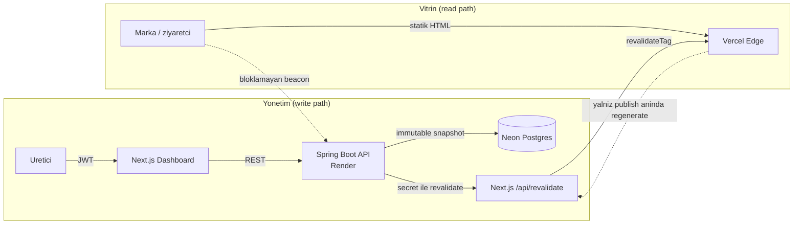

# LocalMediaKit

[](https://github.com/YusufKosarDev/localmediakit/actions/workflows/ci.yml)

Icerik ureticileri (influencer) icin **canli medya kiti** platformu. Uretici;
takipci/etkilesim istatistiklerini, kitle demografisini ve gecmis marka
isbirliklerini tek bir sayfada toplar ve markalarla paylasilabilir bir link
olarak **yayinlar**. Marka bu sayfaya baktiginda uretici bunu analitikten gorur.

> **Egitim / portfolyo projesi.** Uygulama tamamen **ucretsiz** — tum ozellikler
> herkese acik, arayuzde hicbir odeme/yukseltme ogesi yok. Stripe abonelik
> entegrasyonu (idempotent webhook, imza dogrulama, hosted Checkout, plan durum
> makinesi) kodda **butunuyle duruyor ama devre disi**: `PlanPolicy` katmani ve
> FREE/PRO ayrimi mimari olarak korunur, yeni hesaplar PRO baslar. Ucretli
> planlar ileride yalnizca varsayilani geri alarak yeniden acilabilir. "Custom
> domain" ozelligi bir vaat degil, backend olgunlugunu gosteren bir DNS-dogrulama
> **iskeletidir** ("yakinda" olarak isaretli).

## Canli demo

- **Uygulama:** https://localmediakit.vercel.app
- **Ornek public sayfa (edge-cached):** https://localmediakit.vercel.app/demo
- **Panoyu gezmek icin:** `/login` → **"Demo olarak gez"** (dolu bir PRO hesabi;
  her gece sifirlanir). Kimlik: `demo@localmediakit.app` / `demo1234`.
- **API dokumantasyonu (Swagger):** https://localmediakit.onrender.com/swagger-ui.html

## Mimarinin kalbi: write-path / read-path ayrimi

Projenin merkezi karar, **markaya gonderilen public sayfanin backend'e
dokunmadan, edge'den statik servis edilmesidir.** Uretici yayinladiginda backend
degismez bir snapshot uretir ve edge cache'i on-demand revalidate eder; ziyaretci
her zaman edge'den HIT alir. Backend uykuda olsa bile public sayfa acilir.



- **Publish** = mevcut draft'tan **degismez (immutable) snapshot** uretir
  (`media_kit_versions.content_json`). Draft sonradan degisse bile public sayfa
  republish'e kadar sabit kalir. Istatistik, demografi, isbirlikleri ve rate card
  hep publish anindaki degerleriyle **donar**. (Snapshot hala bir `showBadge`
  bayragi tasir ama urun ucretsize donunce rozet arayuzden kaldirildi.)
- **Public okuma** her zaman AKTIF snapshot'tan; ziyaretci akisi backend'e bagli
  degil (Adim 0'da `X-Vercel-Cache: HIT` ile kanitlandi).

## One cikan mimari kararlar

- **Edge HIT + immutable snapshot** — yukaridaki write/read ayrimi. Sifreli kitler
  bu kuralin tek istisnasi: hassas veri edge'e hic girmez, kilit acma per-request
  backend'den gelir; **normal kitler yine de edge HIT.**
- **Draft onizleme — publish'in bilincli tersi.** Sahip kisa omurlu imzali bir
  link uretir (`typ=preview` claim'li JWT; oturum tokeni olarak ASLA kabul
  edilmez, tersi de gecerli); link CANLI taslagi per-request, `no-store` ile
  gosterir. Yayinli sayfa donmus snapshot + edge cache iken onizleme taze veri +
  sifir cache — ayni `KitCard` bileseni, iki zit servis stratejisi.
- **Uretilen OG gorseli** — `opengraph-image.tsx` sayfayla AYNI tag'li fetch'i
  okur: publish tek revalidate ile sayfayi da sosyal karti da tazeler, gorsel
  uyuyan backend'i uyandirmaz. Sifreli kitin kartina istatistik/headline hic girmez.
- **Engagement motoru — Strategy pattern.** Her platformun formulu farkli
  (Instagram takipci-bazli, YouTube/TikTok izlenme-bazli). `EngagementCalculator`
  arayuzu + platform basina implementasyon + registry: yeni platform = yeni sinif,
  mevcut kod degismez (Open/Closed).
- **Otomatik istatistik senkronu — Strategy'nin ikizi.** `StatsProvider` arayuzu
  + registry (yalniz KULLANILABILIR provider'lar: API key'siz provider hic yokmus
  gibi davranir — graceful-enable). YouTube Data API v3 key ile abone/izlenme
  ceker; baglarken dogrulayan fetch ilk olcumu de dusurur. Saatlik batch job
  (overlap guard, kaynak basina transaction, QUOTA'da batch'i durdurma) yalniz
  PRO sahiplerin kaynaklarini gunluk tazeler; her basarili fetch append-only
  `platform_stats` serisine yazar — engagement/buyume bedavaya hesaplanir.
- **Append-only zaman serisi** — `platform_stats` ve `page_views` her olcumde yeni
  satir ekler (upsert yok); trend/buyume ve analitik agregasyonu bundan hesaplanir.
- **Versiyon diff** — append-only versiyon tablosunun ikinci getirisi: iki donmus
  snapshot arasindaki fark saf bir fonksiyon (sifir yeni durum). Eski sema
  nesillerinden snapshot'lar da diff'lenir (eksik listeler normalize edilir);
  gorunurluk kurali gecmis listesiyle ayni (FREE pencere ici, PRO tum gecmis).
- **Fire-and-forget analytics beacon** — statik-edge ile analitik gerginligini
  cozer: sayfa render'dan SONRA bloklamayan bir `POST /api/track` atilir; backend
  uyuyorsa sessizce duser, edge HIT bozulmaz. Anonim gunluk-donen ziyaretci hash'i
  (ham IP saklanmaz), 30 dk oturum penceresiyle dedup, bot filtresi.
- **Marka iletisim formu (lead inbox)** — beacon'in anti-abuse modelinin ayni
  disiplinle ikinci kullanimi: honeypot alani, bot filtresi, ziyaretci basina
  pencere limiti, IP-bazli rate limit; uc HER durumda 202 doner (slug var mi,
  form acik mi — hicbiri sizmaz). Kapatma anahtari cift katmanli: alim ANINDA
  durur (draft bayragi), form ise donmus sayfadan ancak republish ile kalkar.
- **Rate card** — hizmet basina fiyat listesi; istatistik/isbirlikleri gibi
  publish aninda snapshot'a donar, taslak fiyat degisikligi yayindaki sayfayi
  oynatmaz.
- **Idempotent Stripe webhook** — event id ile dedup, etkilerle ayni transaction'da;
  Stripe redelivery'leri yutulur, imza dogrulanir (sahte webhook 400).
- **Graceful-enable** — Stripe env'leri varsa gercek hosted Checkout; yoksa demo
  plan-degistirme ucu devrede (gercek billing aktifken bu uc 403 — odeme bypass'i
  olamaz). Ayni desen tum opsiyonel entegrasyonlarda. Urun ucretsize donunce bu
  akisin **arayuzu kaldirildi**; backend uclari (webhook/checkout/demo-switch)
  dormant olarak kodda kalir, boylece entegrasyon okunabilir.
- **Async DNS dogrulama job'u** — `@Scheduled` batch, overlap guard, per-domain
  transaction + try/catch (biri patlarsa job cokmez), JNDI ile timeout'lu DNS
  cozumleme, `DnsResolver` arayuzuyle test edilebilir durum makinesi.

## Ozellikler (hepsi ucretsiz, herkese acik)

- Sinirsiz medya kiti
- Public sayfa (rozet yok) + uretilen sosyal paylasim karti (OG)
- Istatistik + engagement + demografi
- Draft onizleme linki (30 dk)
- Rate card (calisma ucretleri)
- YouTube istatistik senkronu — elle "simdi senkronla" + gunluk otomatik
- Marka iletisim formu + gelen kutusu (tum gecmis)
- Analitik — tekil ziyaretci + gunluk seri + referrer/cihaz kirilimi
- Versiyon gecmisi (tam) + her versiyona rollback + versiyon karsilastirma (diff)
- PDF export (temiz) + sifre korumasi
- Custom domain (yakinda) — DNS dogrulama iskeleti

> Kodda `PlanPolicy` hala FREE/PRO ayrimini tanimlar ve testler her iki dali da
> dogrular; urun karari geregi herkes PRO oldugu icin bu limitler pratikte
> tetiklenmez. Ucretli planlar `User` varsayilanini geri alarak yeniden acilir.

## Teknoloji

- **Backend:** Java 21, Spring Boot 3.3 (Web, Security/JWT, Data JPA), Flyway,
  Bucket4j (rate limit), stripe-java (test mode), springdoc/OpenAPI. Prod: Neon
  Postgres; local: H2 (PostgreSQL uyumluluk modu — ayni migration'lar).
- **Frontend:** Next.js App Router (React, TypeScript), on-demand ISR + edge cache.
- **Dagitim:** Backend → Render, Frontend → Vercel, DB → Neon. `main`'e push =
  otomatik deploy.

## Yerel calistirma

Backend (JDK 21):
```
cd backend
mvn spring-boot:run          # H2 in-memory, sifir kurulum; http://localhost:8080
```

Frontend:
```
cd frontend
npm install
cp .env.example .env.local   # BACKEND_URL + REVALIDATE_SECRET + NEXT_PUBLIC_BACKEND_URL
npm run build && npm run start
```

`http://localhost:3000` acilir; kayit olup dashboard'dan kit olusturup yayinlayin,
public sayfa `http://localhost:3000/<slug>` adresinde gorunur.

Testler:
```
cd backend && mvn test       # 129 test: slug, snapshot, engagement, analitik,
                             # billing/webhook idempotency, sifre/brute-force,
                             # onizleme tokeni, lead ingestion/honeypot, rate card,
                             # DNS durum makinesi, rate limit, ...

cd frontend && npm test      # 12 test (Vitest + Testing Library): public sayfa
                             # snapshot render'i (istatistik/rozet/preview/eski
                             # snapshot), sifre gate, auth hata eslemesi
```

Her ikisi de her push'ta CI'da kosar (bkz. yukaridaki CI rozeti).

## Proje yapisi

```
backend/  Spring Boot API
  auth, user            JWT kayit/giris, plan (PlanPolicy)
  mediakit              kit CRUD, slug, publish/snapshot/versiyon, sifre
  stats                 istatistik zaman serisi, engagement (Strategy), demografi
  stats/sync            StatsProvider (YouTube API) + scheduled sync batch
  collab                marka isbirlikleri
  ratecard              calisma ucretleri (publish'te snapshot'a donar)
  lead                  marka iletisim formu ingestion + gelen kutusu
  analytics             ziyaretci beacon ingestion + agregasyon
  billing               Stripe test-mode + graceful-enable demo upgrade
  domain                custom domain DNS dogrulama (scheduled job)
  ratelimit             Bucket4j filtresi
  demo                  demo hesap seed + test-hesabi temizligi
frontend/ Next.js App Router
  app/[slug]            public sayfa (edge), KitCard, PasswordGate, PrintButton, beacon, OG gorseli
  app/preview/[token]   draft onizleme (per-request, no-store, noindex)
  app/dashboard         kit editoru + istatistik/analitik/versiyon/domain panelleri
  app/api/revalidate    secret korumali on-demand revalidation
```

## Dogruluk / secret'lar

`.env` / `.env.local` repoya girmez (bkz. `.gitignore`); ornekler `*.env.example`.
Stripe/JWT/analitik salt gibi tum secret'lar yalnizca ortam degiskenlerinde tutulur.
