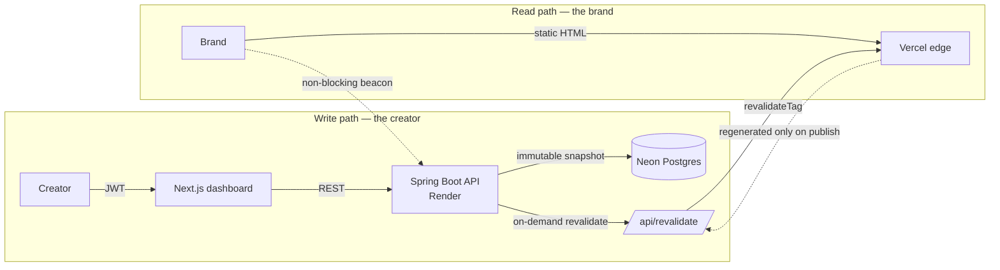

# LocalMediaKit

[](https://github.com/YusufKosarDev/localmediakit/actions/workflows/ci.yml)
[](https://github.com/YusufKosarDev/localmediakit/actions/workflows/security.yml)
[](https://github.com/YusufKosarDev/localmediakit/actions/workflows/e2e.yml)

**A living media kit for content creators.** A creator collects their audience
numbers, demographics and past brand work on one page and publishes it as a link
they send to brands. When a brand opens that link, the creator sees it.

*[Türkçe README](README.tr.md)*


*Recorded against the real stack with Playwright ([`frontend/demo/`](frontend/demo/)) — no edits, no speed-up. Also available as [webm](docs/media/demo.webm).*

| | |
| --- | --- |
| **Live app** | https://localmediakit.vercel.app |
| **A published page** | https://localmediakit.vercel.app/ornek-medya-kiti |
| **API docs** | https://localmediakit.onrender.com/swagger-ui.html |
| **Browse the dashboard** | `/login` → **"Demo olarak gez"** (`demo@localmediakit.app` / `demo1234`, resets hourly) |

> The backend runs on a free tier that sleeps after 15 minutes idle, so the
> first dashboard request can take ~50 seconds. **Published pages are not
> affected** — they are served from the edge and never touch the backend. That
> is the whole point of the section below.

---

## The architecture in one decision

Everything else in this project follows from a single split: **the page a brand
opens must never depend on the backend being awake.**

The obvious implementation is to fetch the kit at request time and render it.
That was rejected, and rejecting it is the design. A link a creator has already
sent to a brand cannot be allowed to load in 50 seconds because the free
instance behind it happened to be asleep — the moment that link is opened is the
one moment the product exists to serve.

So publishing does not "make the page live". Publishing **freezes the draft into
an immutable snapshot** (`media_kit_versions.content_json`) and revalidates the
edge cache once. From then on the visitor is served static HTML from the CDN.
The backend can be down; the page still opens.


```mermaid
flowchart LR
    subgraph W["Write path — the creator"]
        U[Creator] -->|JWT| D[Next.js dashboard]
        D -->|REST| B[Spring Boot API<br/>Render]
        B -->|immutable snapshot| DB[(Neon Postgres)]
        B -->|on-demand revalidate| RV[/api/revalidate/]
    end
    subgraph R["Read path — the brand"]
        M[Brand] -->|static HTML| E[Vercel edge]
        E -.->|regenerated only on publish| RV
        M -.->|non-blocking beacon| B
    end
    RV -->|revalidateTag| E
```

The consequence that makes it real: **editing a draft does not touch the
published page.** Stats, demographics, collaborations, rate card and appearance
are all frozen at the moment of publish, and only another publish moves them.


*The claim, on camera: edit the draft → the public page is unchanged → publish → now it changes. ([webm](docs/media/snapshot.webm))*

Two things had to bend around this, and both are in the repository rather than
in a comment:

- **Analytics.** A static page cannot report a view server-side. A non-blocking
  beacon fires *after* render; if the backend is asleep it fails silently and
  the edge HIT is untouched.
- **Password-protected kits.** The one deliberate exception: sensitive data
  never enters the edge cache at all, and unlocking is a per-request backend
  call. Everything else still gets an edge HIT.

---

## Engineering decisions worth reading

**IDOR is unrepresentable, not prevented.** Every account endpoint lives under
`/api/me` and resolves the subject *only* from the JWT principal. There is no
`/api/users/{id}` — deliberately. A user id is never accepted in a path, query
or body, so one user addressing another is not a check that can be forgotten; it
is a request that cannot be expressed. Kit endpoints carry the same idea as
`findByIdAndUserId` ownership queries.

**A timing side-channel closed by moving mail to an outbox.** Password reset
promises that a registered address and an unknown one are indistinguishable.
Measured against a real provider, they were not: the endpoint took ~1.5s for an
address with an account and ~0.2s for one without, because the SMTP call
happened inline. That is a membership oracle for anyone holding a list of
addresses. The mail is now queued and every request does one insert and returns
— measured live at 0.26–0.45s for both cases, indistinguishable within jitter.
The obvious objection (an outbox needs the plaintext token, which is exactly
what the stored hash withholds) was answered rather than overruled: the queue
row references the token row, and the dispatcher **rotates** it at send time —
new secret, new hash, new expiry. Nothing that can log in is ever at rest, and
because the 30-minute lifetime starts when the mail leaves, a delivery delayed
by a retry is never dead on arrival.

**Outbox for anything a third party could lose.** A brand's enquiry is written
in the same transaction as the notification row — a cheap insert, no network
call — so the mail provider cannot slow down, fail, or lose a lead. When SMTP is
down the only thing that happens is rows waiting in `PENDING`. Each row is
delivered in its own transaction with exponential backoff and a terminal
`FAILED` state, so one bad address cannot roll back the deliveries around it.

**Analytics that cannot identify anyone.** The visitor fingerprint is
`sha256(ip | user-agent | day | salt)`; the raw IP never leaves the function
that hashes it and is never stored. Because the hash includes the day it rotates
at midnight, which also means "all-time unique visitors" was always a sum of
daily uniques — so the retention job can fold raw rows into a daily rollup and
delete them without moving the lifetime numbers.

**Engagement as a strategy, with `Optional.empty()` over a misleading zero.**
Each platform computes engagement differently (Instagram from followers,
YouTube and TikTok from views). One interface, one implementation per platform,
a registry. The part that matters is the return type: a platform with
insufficient data returns empty rather than `0.0`, because a rate card showing
"0% engagement" is worse than showing nothing.

**Accent colours are a curated list, not a colour picker.** Every accent's
contrast was computed against the surfaces it is actually drawn on, in both
light and dark mode, and all pass WCAG AA. `tests/palette.test.ts` recomputes
those ratios *from the shipped CSS*, so adding an inaccessible colour breaks
CI. A picker would have made producing an unreadable page a user's choice; in
this design it cannot be expressed.

**Secrets fail loudly.** Every security-critical value has a working local
default so a clone runs with zero setup — which means a missing production
variable would silently sign session tokens with a key published in this
repository. `ProductionSecretsCheck` refuses to boot the prod profile while any
of them still carries the `local-dev-` marker. It checks the *marker*, not a
list, so a secret added later inherits the protection by following the
convention. This has already fired in production once, exactly as intended.

---

## Quality

| | |
| --- | --- |
| **Backend** | 330 tests (JUnit) — including concurrency races driven by `CyclicBarrier`, migrations run against a *populated* database, and N+1 query-count assertions |
| **Frontend** | 105 tests (Vitest + Testing Library) |
| **End-to-end** | 13 Playwright tests against both servers running for real |
| **Architecture** | ArchUnit rules fail the build — no field injection, controllers never touch repositories, entities never depend on the web layer |
| **Mutation** | PIT on the critical packages: 144 mutations, 97% killed |
| **CI** | Four workflows: `ci.yml` (H2 + **a second job against real PostgreSQL** via Testcontainers + frontend), `e2e.yml`, `security.yml` (Trivy + CodeQL `security-extended`), `mutation.yml` |

Two of those exist because of specific incidents. `MigrationOnPopulatedDatabaseTest`
exists because a migration once added a lowercase default to a column mapped to
an uppercase enum: every pre-existing account became unloadable and returned 500
on its own `/api/me`. A suite that starts from an empty schema cannot see that.
The reserved-slug test reads `frontend/app` and fails the **backend** build when
a route is added without reserving the word — because three routes had already
shipped that a creator could have claimed as their kit's URL.

---

## Honest limits

- **Mail lands in spam more often than it should.** The sender is a `gmail.com`
  address relayed through Brevo, so DMARC alignment fails. Fixing it properly
  needs a custom domain with SPF/DKIM, which is also why the app still lives on
  `*.vercel.app`.
- **Single instance is assumed in three places** — rate-limit buckets, the
  password-attempt counter, and the scheduled jobs' overlap guards are all
  in-memory. A second instance would not crash; it would silently multiply the
  limits and run batches twice, which is the more dangerous failure. The fix is
  Redis-backed Bucket4j and ShedLock, in that order.
- **Avatars are URLs, not uploads.** Free-tier disks are wiped on deploy, so
  object storage would mean either a paid service or a feature that quietly
  loses data.
- **`<html lang>` is hardcoded to `tr`.** A kit published in English still
  declares Turkish, which a screen reader will act on. The published language is
  already per-kit; the layout has not caught up.
- **No API versioning.** There is one client, in this repository, deployed from
  the same commit. Versioning earns its keep when clients you do not control
  exist; the fragile part — the shape of the cached public payload — is already
  handled by `PUBLIC_SCHEMA_VERSION`.
- **Email changes are confirmed by password, not by a link.** Re-authentication
  is the control that actually matters, but a typo in the new address is not
  caught. Now that mail exists, this is unbuilt rather than blocked.

---

## Running it locally

```bash
cd backend  && mvn spring-boot:run     # H2 in-memory, zero setup, :8080
cd frontend && pnpm install && pnpm build && pnpm start   # :3000
```

`cp frontend/.env.example frontend/.env.local` first. Register at
`localhost:3000`, build a kit, publish, and the page appears at
`localhost:3000/<slug>`.

**Stack:** Java 21 · Spring Boot 3.5 · Flyway · Neon Postgres (H2 locally, same
migrations) · Next.js 16 App Router · React 19 · TypeScript · Vercel + Render.
