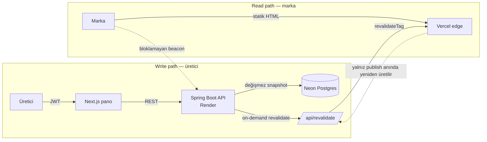

# 📺 LocalMediaKit

İçerik üreticileri için **canlı medya kiti** platformu. Bir üretici; takipçi ve
etkileşim istatistiklerini, kitle demografisini, geçmiş marka iş birliklerini ve
çalışma ücretlerini tek bir sayfada toplar ve markalara gönderdiği bir link
olarak **yayınlar**. Marka o linki açtığında üretici bunu analitikten görür.
Çözdüğü problem şu: üreticiler bu bilgileri her marka görüşmesi için elle
hazırlanmış PDF'lerde taşıyor; PDF gönderildiği anda eskiyor, kimin açtığı
bilinmiyor ve her güncellemede yeniden gönderilmesi gerekiyor.

[](https://github.com/YusufKosarDev/localmediakit/actions/workflows/ci.yml)
[](https://github.com/YusufKosarDev/localmediakit/actions/workflows/e2e.yml)
[](https://github.com/YusufKosarDev/localmediakit/actions/workflows/security.yml)
[](https://github.com/YusufKosarDev/localmediakit/actions/workflows/mutation.yml)


---

## 🔗 Canlı Demo

| | |
| --- | --- |
| **Uygulama** | https://localmediakit.vercel.app |
| **Yayınlanmış örnek sayfa** | https://localmediakit.vercel.app/ornek-medya-kiti |
| **API dokümantasyonu** | https://localmediakit.onrender.com/swagger-ui.html |

**Panoyu gezmek için:** `/login` → **"Demo olarak gez"**

| Alan | Değer |
| --- | --- |
| E-posta | `demo@localmediakit.app` |
| Şifre | `demo1234` |

> Demo hesabı dolu bir PRO hesabıdır ve **saat başı sıfırlanır**. Paylaşılan bir
> hesap olduğu için yıkıcı ayar işlemleri (şifre/e-posta değişimi, hesap silme) o
> hesapta `403` döner — aksi hâlde ilk ziyaretçi şifreyi değiştirip diğerlerini
> dışarıda bırakabilirdi.

> ⏱️ **Soğuk başlangıç:** Backend ücretsiz katmanda ve 15 dakika istek almazsa
> uykuya geçer, panoya ilk giriş ~50 saniye sürebilir. **Yayınlanmış sayfalar
> bundan etkilenmez** — backend'e hiç dokunmazlar. Sebebi
> [Immutable Snapshot & Edge Cache](#-immutable-snapshot--edge-cache) bölümünde.

---

## 📑 İçindekiler

- [🌍 English Summary](#-english-summary)
- [📸 Ekran Kayıtları](#-ekran-kayıtları)
- [✨ Özellikler](#-özellikler)
- [🏆 Öne Çıkan Mühendislik Detayları](#-öne-çıkan-mühendislik-detayları)
- [🧱 Mimari](#-mimari)
- [🔐 Güvenlik](#-güvenlik)
- [⚡ Immutable Snapshot & Edge Cache](#-immutable-snapshot--edge-cache)
- [🛠️ Teknolojiler](#️-teknolojiler)
- [⚙️ Kurulum](#️-kurulum)
- [📟 Komutlar](#-komutlar)
- [🧪 Test & Kalite](#-test--kalite)
- [📁 Proje Yapısı](#-proje-yapısı)
- [🚀 Deploy](#-deploy)
- [⚠️ Dürüst Sınırlar](#️-dürüst-sınırlar)

---

## 🌍 English Summary

**LocalMediaKit** is a living media kit platform for content creators. A creator
collects their audience numbers, demographics, past brand collaborations and
rate card on one page, publishes it as a link they send to brands, and sees when
a brand opens it.

**Highlights**

- **Immutable snapshot + edge-cached public pages.** Publishing freezes the
  draft into a versioned snapshot and revalidates the CDN once. The page a brand
  opens is static HTML and never touches the backend — it loads even while the
  free-tier instance is asleep. Verified in production with `X-Vercel-Cache: HIT`.
- **IDOR is unrepresentable, not merely prevented.** Every account endpoint is
  under `/api/me` and resolves the subject only from the JWT principal. There is
  no `/api/users/{id}`: a user id is never accepted in a path, query or body.
- **A timing side-channel found by measurement and closed.** Password reset
  leaked account existence through response time (~1.5s with an account vs ~0.2s
  without, because SMTP ran inline). Moving the mail to an outbox brought both
  paths to 0.26–0.45s, measured live.
- **Token rotation instead of storing a secret.** The reset outbox references
  the token row rather than the plaintext, and the dispatcher mints a fresh
  secret per delivery attempt — so nothing usable is ever at rest and a retried
  mail is never dead on arrival.
- **Privacy-conscious analytics.** Visitor identity is
  `sha256(ip | user-agent | day | salt)`; the raw IP never leaves the hashing
  function and is never stored. The hash rotates at midnight.
- **Accessibility enforced by CI.** Accent colours are a curated list whose
  contrast ratios are recomputed from the shipped CSS in a test, so an
  inaccessible colour fails the build.
- **Production secrets fail loudly.** The app refuses to boot the prod profile
  while any security-critical value still carries the `local-dev-` marker. This
  has fired in production once, exactly as intended.
- **Quality gates:** 330 backend tests (including concurrency races driven by
  `CyclicBarrier` and migrations run against a populated database), 105 frontend
  tests, 13 Playwright end-to-end tests, 12 ArchUnit architecture rules that
  fail the build, and PIT mutation coverage at 97%.

**Stack:** Java 21 · Spring Boot 3.5 · Spring Security/JWT · Flyway · Neon
PostgreSQL (H2 locally, same migrations) · Next.js 16 App Router · React 19 ·
TypeScript · Tailwind · Vercel + Render.

**Live demo:** https://localmediakit.vercel.app — dashboard via `/login` →
"Demo olarak gez" (`demo@localmediakit.app` / `demo1234`).

---

## 📸 Ekran Kayıtları

Her iki kayıt da Playwright ile **gerçek yığına karşı** üretilir
([`frontend/demo/`](frontend/demo/), `pnpm run demo`). Montaj yok, hızlandırma
yok; alt yazılar kaydın kendisine gömülüdür.

| Ürün akışı | Mimari iddia |
| --- | --- |
|  |  |
| Kayıt → kit oluşturma → istatistik → **Yayınla** → markanın gördüğü public sayfa. ([webm](docs/media/demo.webm)) | Taslağı değiştir → public sayfa **değişmedi** → yayınla → şimdi değişti. ([webm](docs/media/snapshot.webm)) |

---

## ✨ Özellikler

### Hesap & Kimlik

- E-posta + şifre ile kayıt/giriş, **JWT** tabanlı durumsuz oturum
- Şifre değiştirme ve e-posta değiştirme (ikisi de mevcut şifreyle onaylanır)
- **Şifremi unuttum** — tek kullanımlık, 30 dakika ömürlü sıfırlama linki
- **Hesap verisi dışa aktarma (JSON)** — profil, kitler, lead'ler, analitik özet
- Hesap silme — yayındaki sayfaları edge'den de düşürür
- Profil ayarları: ad, avatar, pano teması, arayüz dili

### Medya Kiti

- Sınırsız kit + **kit kopyalama** (marka başına ayrı kit)
- Otomatik slug üretimi, çakışma çözümü ve rezerve kelime koruması
- **Yayınla** = değişmez snapshot üretir; taslak sonradan değişse bile yayındaki sayfa sabit kalır
- **Versiyon geçmişi**, her versiyona **rollback**, iki versiyon arası **diff**
- **Zamanlanmış yayın** — seçilen anda otomatik publish
- **Taslak önizleme linki** — 30 dk ömürlü, imzalı, `noindex`, canlı taslağı gösterir
- **Şifre koruması** — hassas veri edge'e hiç girmez, kilit açma per-request

### İstatistik & Kitle

- Platform bazlı takipçi/izlenme/beğeni/yorum zaman serisi (append-only)
- **Engagement hesabı** — platform başına ayrı formül (Strategy pattern)
- Kitle demografisi: yaş, cinsiyet, ülke
- **YouTube senkronu** — elle "şimdi senkronla" + günlük otomatik tazeleme

### İçerik & Ticari

- **Öne çıkan içerikler** — link + kapak görseli, publish ile snapshot'a döner
- **Marka iş birlikleri** — kampanya, dönem, sonuç notu
- **Rate card** — hizmet başına fiyat listesi, publish ile donar

### Public Sayfa

- Edge'den statik servis, üretilen **OG sosyal paylaşım kartı**
- **PDF olarak indir** (temiz çıktı)
- Görünüm: 6 kurate vurgu rengi + 2 düzen varyantı + açık/koyu tema
- Yayın dili kit başına (TR/EN)

### Lead & Analitik

- **Marka iletişim formu** — honeypot, bot filtresi, ziyaretçi ve IP bazlı limit
- **Gelen kutusu** + durum yönetimi + **CSV dışa aktarım**
- **Lead bildirimi e-postası** (outbox üzerinden, ayarlardan kapatılabilir)
- **Analitik** — tekil ziyaretçi, günlük seri, referrer ve cihaz kırılımı
- **Markaya özel paylaşım linkleri** — her marka için etiketli link, kimin açtığı görünür, iptal edilebilir

### Diğer

- **Onboarding** — karşılama turu + veriden türetilen kontrol listesi
- **PWA** — pano ana ekrana eklenip uygulama gibi açılabilir
- **Custom domain** — DNS doğrulama iskeleti ("yakında" olarak işaretli)
- Stripe abonelik entegrasyonu kodda bütünüyle duruyor ama **devre dışı**; ürün ücretsiz, herkes PRO

---

## 🏆 Öne Çıkan Mühendislik Detayları

**IDOR engellenmiş değil, ifade edilemez.** Bütün hesap uçları `/api/me` altında
ve özneyi *yalnızca* JWT principal'ından çözer. `/api/users/{id}` karşılığı
bilerek yok: kullanıcı kimliği path'te, query'de veya gövdede hiçbir zaman kabul
edilmediği için "birinin diğerini adreslemesi" unutulabilecek bir kontrol değil,
kurulamayan bir istek. Kit uçlarında aynı fikir `findByIdAndUserId` sahiplik
sorgusu olarak duruyor.

**Ölçerek bulunan bir zamanlama yan kanalı.** Şifre sıfırlama, kayıtlı bir
adresle bilinmeyen bir adresin ayırt edilemeyeceğini vaat eder. Gerçek bir
sağlayıcıya karşı etmiyordu — SMTP çağrısı isteğin içinde olduğu için **~1.5 sn'ye
karşı ~0.2 sn**, ki bu elinde adres listesi olan biri için bir üyelik sorgusu.
Mail outbox'a taşındı; her istek artık tek bir insert yapıp dönüyor ve canlıda
iki durum için de **0.26–0.45 sn** ölçüldü.

**Düz metin token itirazı geçersiz kılınmadı, çözüldü.** Outbox'a geçmenin bariz
itirazı şuydu: arka plan işi düz metin token'a ihtiyaç duyar, oysa hash'in var
olma sebebi tam da onu saklamamak. Çözüm, kuyruk satırının token'ı değil token
**satırının id'sini** tutması; dispatcher gönderim anında o satırı **döndürüyor**
— yeni sır, yeni hash, yeni son kullanma. Böylece giriş yapabilecek hiçbir şey
diske inmiyor ve 30 dakikalık ömür mailin çıktığı anda başladığı için yeniden
denenen bir teslimat asla ölü link taşımıyor.

**Outbox, üçüncü tarafın kaybedebileceği her şey için.** Markanın teklifi,
bildirim satırıyla **aynı transaction'da** yazılır — ucuz bir insert, ağ çağrısı
yok — bu yüzden mail sağlayıcısı bir lead'i yavaşlatamaz, başarısız edemez,
kaybettiremez. SMTP çöktüğünde olan tek şey satırların `PENDING` beklemesidir.
Her satır kendi transaction'ında, üstel backoff ve terminal `FAILED` durumuyla
işlenir.

**Kimseyi tanımlayamayan analitik.** Ziyaretçi parmak izi
`sha256(ip | user-agent | gün | salt)`; ham IP onu hash'leyen fonksiyondan dışarı
çıkmaz ve hiçbir yerde saklanmaz. Hash günü içerdiği için gece yarısı döner —
bunun ikinci anlamı şu: "tüm zamanların tekil ziyaretçisi" zaten günlük
tekillerin toplamıydı, dolayısıyla retention işi ham satırları günlük özete
katlayıp silebiliyor ve ömür boyu sayılar hiç oynamıyor.

**Erişilebilirlik CI'da zorlanıyor.** Vurgu renkleri serbest seçim değil, kurate
bir liste. Her rengin kontrastı gerçekten üzerine çizildiği yüzeylere karşı ve
her iki temada hesaplandı; `tests/palette.test.ts` bu oranları **sevk edilen
CSS'ten** yeniden hesapladığı için erişilemez bir renk eklemek CI'ı kırar. Renk
seçici konsaydı okunamayan bir sayfa üretmek kullanıcının tercihi olurdu.

**Secret'lar sessizce değil, gürültüyle patlar.** Güvenlik açısından kritik her
değerin çalışan bir yerel varsayılanı var, böylece repoyu klonlayan sıfır
kurulumla çalıştırır — ki bu da üretimde eksik kalan bir değişkenin, oturum
tokenlerini bu repoda yayınlanmış bir sırla imzalaması demek.
`ProductionSecretsCheck`, bunlardan biri hâlâ `local-dev-` işaretini taşırken
prod profilini başlatmayı reddeder. Bilinen değerlerin listesini değil **işareti**
kontrol ettiği için sonradan eklenen bir secret korumayı yalnızca kurala uyarak
devralır. Üretimde bir kez tam da amaçlandığı gibi devreye girdi.

**Eşzamanlılık: kontrol-et-sonra-yaz yolları.** Üç yerde bir değer "hâlihazırda
ne var" okunarak seçiliyor: bir sonraki boş slug, bir sonraki versiyon numarası,
bir platformun kaynak satırı. Okuma ile yazma arasına giren ikinci bir istek
yalnızca unique constraint tarafından fark edilir — ve fark etmesi gereken de
odur. Yanlış olan tepkiydi: ihlal `500` olarak dışarı çıkıyordu. `ConstraintRetry`
ihlali yakalar, işi yeni bir transaction'da yeniden çalıştırır ve tükendiğinde
`409` döner. Testler yarışı umut ederek değil `CyclicBarrier` ile üretir.

**Rezerve slug listesi tahminle değil dizin okunarak korunur.** Yayınlanmış bir
kit `/<slug>` adresinde yaşıyor, yani frontend'in kendi rotalarıyla aynı URL
alanında. `ReservedSlugRoutesTest` `frontend/app` dizinini okur ve rezerve
edilmemiş bir üst seviye rota bulursa **backend build'ini** kırar — çünkü
üreticinin sahiplenebileceği üç rota (`forgot`, `reset`, `offline`) sessizce sevk
edilmişti.

---

## 🧱 Mimari


```mermaid
flowchart LR
    subgraph W["Write path — üretici"]
        U[Üretici] -->|JWT| D[Next.js pano]
        D -->|REST| B[Spring Boot API<br/>Render]
        B -->|değişmez snapshot| DB[(Neon Postgres)]
        B -->|on-demand revalidate| RV[/api/revalidate/]
    end
    subgraph R["Read path — marka"]
        M[Marka] -->|statik HTML| E[Vercel edge]
        E -.->|yalnız publish anında yeniden üretilir| RV
        M -.->|bloklamayan beacon| B
    end
    RV -->|revalidateTag| E
```

Sistem iki yola ayrılmıştır ve bu ayrım projedeki her kararın kaynağıdır.

**Write path (üretici).** Pano, JWT ile korunan REST uçlarını çağırır. Kit
düzenleme, istatistik girişi, iş birlikleri, rate card — hepsi taslak üzerinde
çalışır ve yayındaki sayfaya dokunmaz. Yayınlama anında backend, taslaktan
değişmez bir snapshot üretip `media_kit_versions` tablosuna yazar ve frontend'in
`/api/revalidate` ucunu secret ile çağırır.

**Read path (marka).** Ziyaretçi, backend'e hiç uğramadan Vercel edge'inden
statik HTML alır. Backend uykuda, bakımda veya tamamen kapalı olabilir; sayfa
yine açılır. Sayfa yalnızca üretici yayınladığında yeniden üretilir.

**İki yolun kesiştiği tek yer bloklamayan beacon'dır.** Statik bir sayfa
görüntülenmeyi sunucu tarafında bildiremediği için, render'dan *sonra*
`POST /api/track` atılır. Backend uykudaysa bu istek sessizce düşer ve edge HIT
bozulmaz — analitik kaybı kabul edilir, sayfanın açılmaması kabul edilmez.

---

## 🔐 Güvenlik

| Önlem | Uygulama |
| --- | --- |
| Kimlik doğrulama | JWT (HS256), `STATELESS` oturum, CSRF kapalı (çerez yok) |
| Şifre saklama | BCrypt |
| Yetkilendirme | Özne yalnızca JWT principal'ından; `/api/users/{id}` yok |
| Sahiplik | Kit uçlarında `findByIdAndUserId` sorguları |
| Rate limit | Bucket4j, IP başına: login, register, track, unlock, contact, hesap işlemleri |
| Şifre denemesi | Kit kilidi açmada 5 hata / 15 dakika penceresi |
| İstemci IP | `CF-Connecting-IP` önce, yoksa X-Forwarded-For'un **en sağdaki** hop'u (spoof edilemez) |
| Prod secret'ları | `ProductionSecretsCheck` — `local-dev-` işaretli secret'la başlamayı reddeder |
| CORS | Tanımlı origin listesi, wildcard header yok |
| Güvenlik başlıkları | CSP, HSTS (preload), `X-Frame-Options: DENY`, `nosniff`, Referrer-Policy, Permissions-Policy |
| XSS | React otomatik kaçış + public sayfa JSON-LD'sinde ayrı kaçış katmanı |
| Metrikler | `/actuator/health` public, `/actuator/prometheus` oturum arkasında |
| Hata gövdeleri | Stacktrace ve iç mesaj asla dönmez |
| Bağımlılıklar | Trivy (HIGH/CRITICAL'da build kırılır) + CodeQL `security-extended` |
| Sızıntı önleme | Şifre sıfırlama ucu hesabın varlığını ne yanıtla ne süreyle sızdırır |

---

## ⚡ Immutable Snapshot & Edge Cache

Bu proje tek bir karar etrafında kuruludur: **markanın açtığı sayfa, backend'in
uyanık olmasına asla bağlı olmamalı.**

### Reddedilen alternatif

Akla ilk gelen çözüm, public sayfayı istek anında backend'den veri çekerek
render etmek. Bu, üzerinde en çok düşünülen ve **kasten reddedilen** seçenek.

Sebep somut: backend ücretsiz katmanda çalışıyor ve 15 dakika istek almazsa
uykuya geçiyor, uyanması ~50 saniye sürüyor. Üreticinin markaya haftalar önce
gönderdiği bir link, arkasındaki instance uyuduğu için 50 saniye boyunca boş
ekran gösteremez. O linkin açıldığı an, ürünün var olma sebebi olan tek andır.

Runtime fetch'in ikinci sorunu daha sinsi: çalıştığı zaman bile sistemin en
kritik yolunu en kırılgan bileşene bağlar. Backend'deki bir hata, bir migration,
bir deploy penceresi — hepsi doğrudan markanın gördüğü sayfaya yansır.

### Seçilen çözüm

Yayınlamak "sayfayı canlı yapmak" değildir. Yayınlamak iki şey yapar:

1. Mevcut taslaktan **değişmez bir snapshot** üretir ve
   `media_kit_versions.content_json` sütununa yazar. İstatistik, demografi, iş
   birlikleri, rate card, öne çıkan içerikler ve görünüm ayarları publish anındaki
   değerleriyle **donar**.
2. Frontend'in `/api/revalidate` ucunu secret ile çağırıp edge cache'i **bir kez**
   tazeler.

Sonrasında ziyaretçi her zaman CDN'den statik HTML alır.

### Bunu somut kılan sonuç

**Taslağı düzenlemek yayındaki sayfaya dokunmaz.** Üretici fiyatını değiştirebilir,
yeni istatistik girebilir, temayı değiştirebilir — markanın elindeki link
değişmez. Sayfayı ancak bir sonraki publish oynatır.


Bu kaydın kendisi de bir doğrulama: taslak düzenlenir, public sayfanın
değişmediği gösterilir, yayınlanır ve ancak o zaman değişir.

### Kuralın büktüğü iki yer

| Durum | Neden | Çözüm |
| --- | --- | --- |
| **Analitik** | Statik sayfa görüntülenmeyi sunucu tarafında bildiremez | Render'dan sonra bloklamayan beacon; backend uykudaysa sessizce düşer, edge HIT bozulmaz |
| **Şifre korumalı kitler** | Hassas veri CDN'e hiç girmemeli | Kuralın bilinçli tek istisnası: public payload'da istatistik/demografi/iş birlikleri `null`, kilit açma per-request backend çağrısı |

### Nasıl doğrulandı

- Canlıda ardışık isteklerde `X-Vercel-Cache: HIT` — public sayfa gerçekten
  edge'den geliyor
- Yayın sonrası `STALE → HIT` geçişi gözlendi: revalidation tetikleniyor ve
  sayfa yeniden üretiliyor
- Taslak başlığı değiştirildi, public payload'ın publish anındaki değerde kaldığı
  doğrulandı
- Şifre korumalı bir kitin public payload'ında `platforms`, `demographics`,
  `collaborations` alanlarının `null` geldiği doğrulandı
- Aynı akış `snapshot.spec.ts` içinde otomatik kayıt olarak da koşuyor

### Ölçek sınırı

Bu mimarinin nereye kadar gittiği de yazılı: rate-limit kovaları, şifre denemesi
sayacı ve zamanlanmış işlerin overlap guard'ları **bellekte**. İkinci bir
instance açıldığında hiçbiri patlamaz, hepsi sessizce yanlış çalışır — limitler
instance sayısı kadar çarpılır, batch'ler üst üste koşar. Değişmesi gerekenler
sırasıyla: Redis destekli Bucket4j, ShedLock, paylaşılan unlock sayacı.
**Değişmesi gerekmeyen:** public sayfa, çünkü zaten edge'de.

---

## 🛠️ Teknolojiler

| Katman | Teknoloji |
| --- | --- |
| Backend | Java 21, Spring Boot 3.5, Spring Web, Spring Security (JWT), Spring Data JPA |
| Veritabanı | Neon PostgreSQL (prod), H2 PostgreSQL uyumluluk modu (yerel) — **aynı migration'lar** |
| Migration | Flyway (27 migration) |
| Rate limit | Bucket4j + Caffeine |
| Dokümantasyon | springdoc / OpenAPI 3 |
| Mail | Düz SMTP (vendor SDK'sı yok — sağlayıcı değişimi env işidir) |
| Frontend | Next.js 16 App Router, React 19, TypeScript, Tailwind CSS |
| Grafikler | Recharts |
| Test (backend) | JUnit 5, AssertJ, Mockito, Testcontainers, ArchUnit, PIT |
| Test (frontend) | Vitest, Testing Library, Playwright, axe |
| CI/CD | GitHub Actions (4 workflow), Trivy, CodeQL |
| Barındırma | Render (backend), Vercel (frontend), Neon (veritabanı) |

---

## ⚙️ Kurulum

### Gereksinimler

| Araç | Sürüm |
| --- | --- |
| JDK | 21 |
| Node.js | 22 |
| pnpm | `corepack` ile sağlanır (`packageManager` alanı) |
| Docker | Yalnızca `postgres` etiketli testler için (opsiyonel) |

### Adımlar

```bash
git clone https://github.com/YusufKosarDev/localmediakit.git
cd localmediakit

# 1) Backend — H2 in-memory, sıfır kurulum
cd backend
mvn spring-boot:run                  # http://localhost:8080

# 2) Frontend
cd ../frontend
cp .env.example .env.local
pnpm install
pnpm build && pnpm start             # http://localhost:3000
```

`http://localhost:3000` adresinden kayıt olun, kit oluşturup yayınlayın; public
sayfa `http://localhost:3000/<slug>` adresinde görünür.

> Commit hook'unu etkinleştirmek için (klon başına bir kez):
> `git config core.hooksPath .githooks`

---

## 📟 Komutlar

### Backend

| Komut | Ne yapar |
| --- | --- |
| `mvn spring-boot:run` | Uygulamayı H2 ile çalıştırır |
| `mvn test` | 330 test (Docker gerekmez) |
| `mvn verify` | Test + paketleme |
| `mvn test -Dgroups=postgres -Dsurefire.excluded.groups=` | Gerçek PostgreSQL'e karşı Testcontainers testleri |
| `mvn -Pmutation test-compile org.pitest:pitest-maven:mutationCoverage` | PIT mutasyon analizi |

### Frontend

| Komut | Ne yapar |
| --- | --- |
| `pnpm dev` | Geliştirme sunucusu |
| `pnpm build` / `pnpm start` | Üretim derlemesi / sunucusu |
| `pnpm test` | 105 Vitest testi |
| `pnpm test:e2e` | 13 Playwright testi (iki sunucuyu kendisi ayağa kaldırır) |
| `pnpm lint` / `pnpm typecheck` | ESLint / TypeScript kontrolü |
| `pnpm demo` | README kayıtlarını yeniden üretir (kayıt + GIF dönüşümü) |

---

## 🧪 Test & Kalite

| Katman | Kapsam |
| --- | --- |
| **Backend** | **330 test** — slug, snapshot/publish, engagement, analitik ve retention, lead ingestion/honeypot, şifre sıfırlama outbox'ı, önizleme tokeni, rate limit, prod secret kontrolü, eşzamanlı yazma yarışları (`CyclicBarrier`), **dolu veritabanına karşı migration**, N+1 sorgu sayısı |
| **Frontend** | **105 test** (Vitest + Testing Library) — public sayfa snapshot render'ı, şifre gate, auth hata eşlemesi, JSON-LD kaçışı, palet kontrastı, service worker, güvenlik başlıkları |
| **Uçtan uca** | **13 Playwright testi** — iki sunucu da gerçekten ayaktayken; kayıt→kit→yayın akışı, pano, paylaşım linkleri, `axe` ile erişilebilirlik denetimi |
| **Mimari** | **12 ArchUnit kuralı** build'i kırar — field injection yok, controller repository'ye dokunmaz, entity web katmanına bağımlı olmaz, plan sabitleri paketinden çıkmaz |
| **Mutasyon** | Kritik paketlerde PIT: **144 mutasyonun %97'si** öldürülüyor |

### CI Workflow'ları

| Workflow | Tetikleyici | İçerik |
| --- | --- | --- |
| `ci.yml` | Her push/PR | Backend (H2) · **Backend gerçek PostgreSQL'e karşı** (Testcontainers) · Frontend (typecheck + lint + test + build) |
| `e2e.yml` | Her push/PR | Playwright, iki sunucu birden ayakta |
| `security.yml` | Her push/PR + haftalık | Trivy (HIGH/CRITICAL'da kırılır) + CodeQL (`security-extended`, java-kotlin & javascript-typescript) |
| `mutation.yml` | Haftalık + elle | PIT mutasyon analizi |

### İki test, iki gerçek olaydan doğdu

- **`MigrationOnPopulatedDatabaseTest`** — bir migration, küçük harfli bir
  varsayılanı büyük harfli bir enum'a eşlenen kolona yazdı; o andan önceki her
  hesap yüklenemez oldu ve kendi `/api/me` ucunda `500` döndü. Boş şemadan
  başlayan bir test paketi bunu göremez, bu yüzden bu test yarıya kadar migrate
  eder, canlı bir veritabanının tutacağı satırları yazar, sonra bitirir.
- **`ReservedSlugRoutesTest`** — `forgot`, `reset` ve `offline` rotaları rezerve
  kelime listesine eklenmeden sevk edilmişti; bir üretici kitine `forgot` adını
  verebilirdi. Test artık `frontend/app` dizinini okuyor ve eksik bir segment
  bulursa backend build'ini kırıyor.

---

## 📁 Proje Yapısı

```
backend/                     Spring Boot API
  auth, user, recovery       JWT kayıt/giriş, hesap ayarları, şifre sıfırlama outbox'ı
  mediakit                   kit CRUD, slug, publish/snapshot/versiyon, zamanlanmış yayın
  media                      öne çıkan içerikler
  stats, stats/sync          zaman serisi, engagement (Strategy), YouTube senkron batch'i
  collab, ratecard           marka iş birlikleri, çalışma ücretleri
  lead, notification         iletişim formu ingestion, gelen kutusu, bildirim outbox'ı
  analytics                  beacon ingestion, agregasyon, paylaşım linkleri, retention
  domain                     custom domain DNS doğrulama (scheduled job)
  billing                    Stripe (dormant)
  ratelimit, security        Bucket4j filtresi, JWT filtresi, SecurityConfig
  observability              OperationalMetrics, RequestIdFilter
  config, shared, demo       prod secret kontrolü, ConstraintRetry/Csv/ClientIp, demo seed

frontend/                    Next.js App Router
  app/[slug]                 public sayfa (edge), KitCard, PasswordGate, beacon, OG görseli
  app/preview/[token]        taslak önizleme (per-request, no-store, noindex)
  app/dashboard              kit editörü + 9 panel (istatistik, analitik, versiyon, lead, ...)
  app/dashboard/settings     profil, şifre/e-posta değişimi, dışa aktarma, hesap silme
  app/forgot, app/reset      şifre sıfırlama akışı
  app/api/revalidate         secret korumalı on-demand revalidation
  demo/                      README kayıtlarını üreten Playwright senaryoları
  tests/, e2e/               Vitest ve Playwright paketleri

docs/media/                  demo.gif/webm, snapshot.gif/webm
.githooks/                   versiyonlanmış commit-msg hook'u
```

---

## 🚀 Deploy

| Bileşen | Platform | Not |
| --- | --- | --- |
| Backend | Render (Docker) | `main`'e push = otomatik deploy |
| Frontend | Vercel | `main`'e push = otomatik deploy |
| Veritabanı | Neon PostgreSQL | `DATABASE_URL` **pooled** endpoint'i göstermeli |

### Backend ortam değişkenleri

| Değişken | Zorunlu | Açıklama |
| --- | --- | --- |
| `SPRING_PROFILES_ACTIVE` | ✅ | `prod` |
| `DATABASE_URL` / `DB_USERNAME` / `DB_PASSWORD` | ✅ | Neon bağlantısı |
| `JWT_SECRET` | ✅ | HS256, ≥32 bayt. Eksikse uygulama **başlamaz** |
| `REVALIDATE_SECRET` | ✅ | Frontend'deki değerle aynı olmalı. Eksikse **başlamaz** |
| `REVALIDATE_URL` | ✅ | `https://<app>.vercel.app/api/revalidate` |
| `ANALYTICS_SALT` | ✅ | Ziyaretçi hash'ini tuzlar. Eksikse **başlamaz** |
| `FRONTEND_URL` | ✅ | E-postalardaki linklerin tabanı |
| `CORS_ALLOWED_ORIGINS` | ✅ | Panonun origin'i |
| `MAIL_HOST` / `MAIL_PORT` / `MAIL_USERNAME` / `MAIL_PASSWORD` / `MAIL_FROM` | ➖ | Boşsa mail özellikleri sessizce kapalı. **`MAIL_HOST` ve `MAIL_FROM` birlikte dolu olmalı** |
| `YOUTUBE_API_KEY` | ➖ | Boşsa YouTube senkronu hiç sunulmaz |
| `STRIPE_*` | ➖ | Boşsa billing 503 döner (ürün ücretsiz, akış dormant) |

### Frontend ortam değişkenleri

| Değişken | Açıklama |
| --- | --- |
| `BACKEND_URL` | Sunucu tarafı fetch'lerin hedefi |
| `NEXT_PUBLIC_BACKEND_URL` | Tarayıcının çağırdığı origin (beacon, unlock, pano) |
| `REVALIDATE_SECRET` | Backend'deki değerle aynı olmalı |

> `.env` ve `.env.local` repoya girmez (`.gitignore`); yalnızca `*.env.example`
> dosyaları versiyonlanır ve içlerinde gerçek değer bulunmaz.

---

## ⚠️ Dürüst Sınırlar

Bunlar bilinmeyen eksikler değil, ölçülmüş ve kayda geçirilmiş sınırlardır.

| Sınır | Ayrıntı |
| --- | --- |
| **Mail teslimat kalitesi** | Gönderen bir `gmail.com` adresi ve mail Brevo rölesinden çıkıyor, dolayısıyla DMARC hizalaması tutmuyor ve mailler spam'e düşebilir. Uygulama `*.vercel.app` üzerinde olduğu için SPF/DKIM kaydı eklenemiyor. Çözümü özel bir domain. |
| **Tek instance varsayımı** | Rate-limit kovaları, şifre denemesi sayacı ve zamanlanmış işlerin overlap guard'ları bellekte. İkinci bir instance çökmez; limitleri sessizce çarpar ve batch'leri üst üste koşturur — daha tehlikeli bozulma biçimi budur. |
| **Avatar yükleme yok** | Avatar bir URL'dir. Ücretsiz katman diski her deploy'da silindiği için nesne deposu ya ücretli bir servis ya da sessizce veri kaybeden bir çözüm olurdu. |
| **`<html lang>` sabit `tr`** | İngilizce yayınlanmış bir kit ekran okuyucuya Türkçe bildiriyor. Yayın dili zaten kit başına tutuluyor; layout henüz yetişmedi. |
| **API versiyonlama yok** | Tek istemci var, o da bu repoda ve aynı commit'ten dağıtılıyor. Kırılgan olan kısım — cache'lenen public payload'ın şekli — `PUBLIC_SCHEMA_VERSION` ile ele alınıyor. Dışarıdan bir istemci çıktığı gün versiyonlama da çıkar. |
| **E-posta değişimi doğrulanmıyor** | Değişim mevcut şifreyle onaylanır; bu, açık kalmış bir oturumun hesabı sessizce taşımasını engelleyen asıl kontrol. Ancak adres yanlış yazılırsa yakalanmıyor. Mail altyapısı artık mevcut, dolayısıyla bu engellenmiş değil, **yapılmamış** bir iş. |
| **Piksel bazlı görsel regresyon yok** | Baseline görüntüler üretildikleri platformun font rasterizasyonunu taşır; yerelde üretilip CI'da karşılaştırılan bir baseline her zaman kırmızı döner. Dayanıklı olan kısım korunuyor: palet kontrastı, güvenlik başlıkları ve `axe` denetimi testlerde. |
