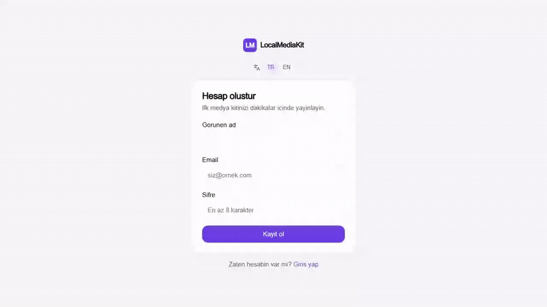
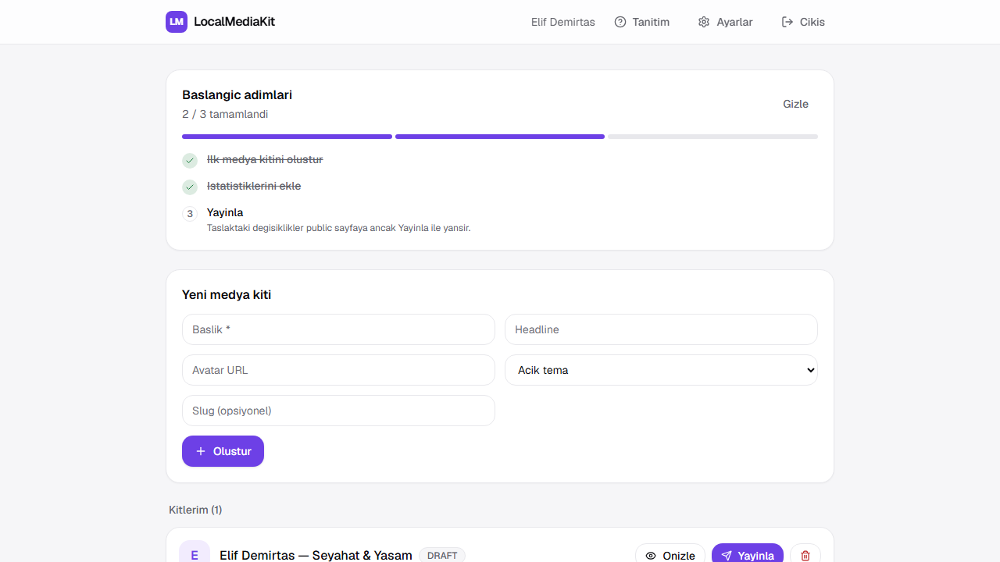
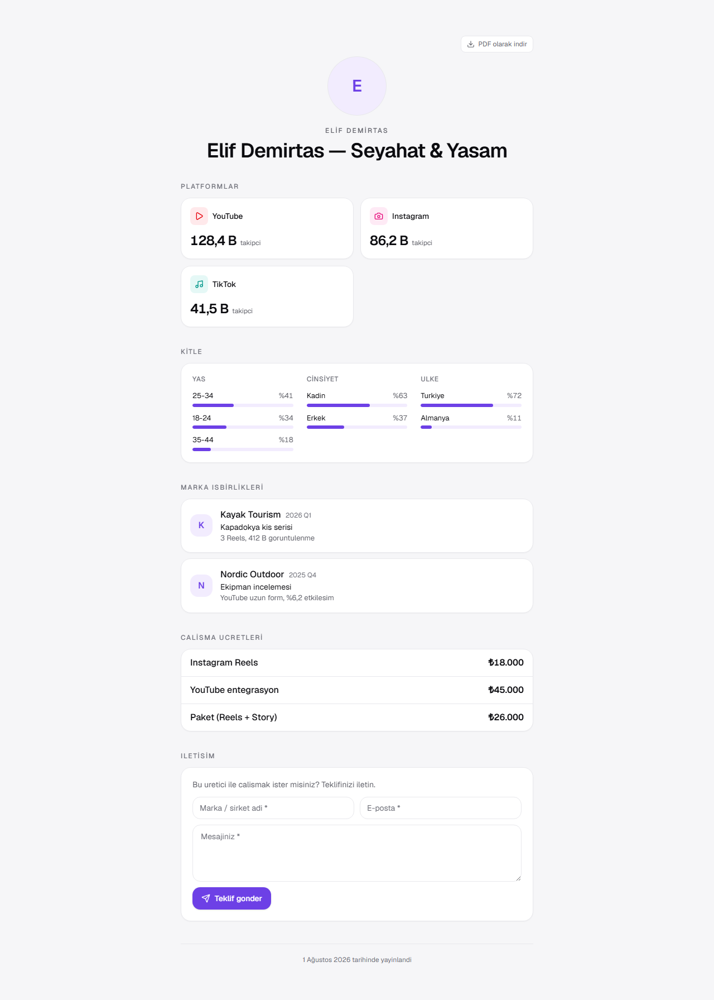
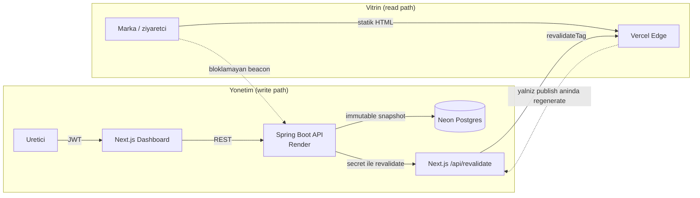

# LocalMediaKit

[](https://github.com/YusufKosarDev/localmediakit/actions/workflows/ci.yml)

Icerik ureticileri (influencer) icin **canli medya kiti** platformu. Uretici;
takipci/etkilesim istatistiklerini, kitle demografisini ve gecmis marka
isbirliklerini tek bir sayfada toplar ve markalarla paylasilabilir bir link
olarak **yayinlar**. Marka bu sayfaya baktiginda uretici bunu analitikten gorur.

> **Egitim / portfolyo projesi.** Uygulama tamamen **ucretsiz** — tum ozellikler
> herkese acik, arayuzde hicbir odeme/yukseltme ogesi yok. Stripe abonelik
> entegrasyonu (idempotent webhook, imza dogrulama, hosted Checkout, plan durum
> makinesi) kodda **butunuyle duruyor ama devre disi**: `PlanPolicy` katmani ve
> FREE/PRO ayrimi mimari olarak korunur, yeni hesaplar PRO baslar. Ucretli
> planlar ileride yalnizca varsayilani geri alarak yeniden acilabilir. "Custom
> domain" ozelligi bir vaat degil, backend olgunlugunu gosteren bir DNS-dogrulama
> **iskeletidir** ("yakinda" olarak isaretli).

## Canli demo



_Kayit → kit olusturma → istatistik → **Yayinla** → markanin gordugu public sayfa.
Kayit `frontend/demo/record.spec.ts` ile gercek yigina karsi uretilir
(`pnpm run demo:record`); montaj yok, hizlandirma yok._

- **Uygulama:** https://localmediakit.vercel.app
- **Ornek public sayfa (edge-cached):** https://localmediakit.vercel.app/ornek-medya-kiti
- **Panoyu gezmek icin:** `/login` → **"Demo olarak gez"** (dolu bir PRO hesabi;
  her gece sifirlanir). Kimlik: `demo@localmediakit.app` / `demo1234`.
- **API dokumantasyonu (Swagger):** https://localmediakit.onrender.com/swagger-ui.html

> Backend Render'in ucretsiz katmaninda; 15 dakika istek almazsa uykuya gecer ve
> ilk istek ~50-60 saniye surer. **Public sayfa bundan etkilenmez** — edge'den
> statik gelir. Panoya girerken ilk yanit gecikirse sebebi budur.

| Pano (write path) | Public sayfa (read path) |
| --- | --- |
|  |  |

## Mimarinin kalbi: write-path / read-path ayrimi

Projenin merkezi karar, **markaya gonderilen public sayfanin backend'e
dokunmadan, edge'den statik servis edilmesidir.** Uretici yayinladiginda backend
degismez bir snapshot uretir ve edge cache'i on-demand revalidate eder; ziyaretci
her zaman edge'den HIT alir. Backend uykuda olsa bile public sayfa acilir.


```mermaid
flowchart LR
    subgraph Yonetim["Yonetim (write path)"]
        U[Uretici] -->|JWT| D[Next.js Dashboard]
        D -->|REST| B[Spring Boot API<br/>Render]
        B -->|immutable snapshot| DB[(Neon Postgres)]
        B -->|secret ile revalidate| RV[Next.js /api/revalidate]
    end
    subgraph Vitrin["Vitrin (read path)"]
        M[Marka / ziyaretci] -->|statik HTML| E[Vercel Edge]
        E -.->|yalniz publish aninda regenerate| RV
        M -.->|bloklamayan beacon| B
    end
    RV -->|revalidateTag| E
```

- **Publish** = mevcut draft'tan **degismez (immutable) snapshot** uretir
  (`media_kit_versions.content_json`). Draft sonradan degisse bile public sayfa
  republish'e kadar sabit kalir. Istatistik, demografi, isbirlikleri ve rate card
  hep publish anindaki degerleriyle **donar**. (Snapshot hala bir `showBadge`
  bayragi tasir ama urun ucretsize donunce rozet arayuzden kaldirildi.)
- **Public okuma** her zaman AKTIF snapshot'tan; ziyaretci akisi backend'e bagli
  degil (Adim 0'da `X-Vercel-Cache: HIT` ile kanitlandi).

## One cikan mimari kararlar

- **Edge HIT + immutable snapshot** — yukaridaki write/read ayrimi. Sifreli kitler
  bu kuralin tek istisnasi: hassas veri edge'e hic girmez, kilit acma per-request
  backend'den gelir; **normal kitler yine de edge HIT.**
- **Draft onizleme — publish'in bilincli tersi.** Sahip kisa omurlu imzali bir
  link uretir (`typ=preview` claim'li JWT; oturum tokeni olarak ASLA kabul
  edilmez, tersi de gecerli); link CANLI taslagi per-request, `no-store` ile
  gosterir. Yayinli sayfa donmus snapshot + edge cache iken onizleme taze veri +
  sifir cache — ayni `KitCard` bileseni, iki zit servis stratejisi.
- **Uretilen OG gorseli** — `opengraph-image.tsx` sayfayla AYNI tag'li fetch'i
  okur: publish tek revalidate ile sayfayi da sosyal karti da tazeler, gorsel
  uyuyan backend'i uyandirmaz. Sifreli kitin kartina istatistik/headline hic girmez.
- **Engagement motoru — Strategy pattern.** Her platformun formulu farkli
  (Instagram takipci-bazli, YouTube/TikTok izlenme-bazli). `EngagementCalculator`
  arayuzu + platform basina implementasyon + registry: yeni platform = yeni sinif,
  mevcut kod degismez (Open/Closed).
- **Otomatik istatistik senkronu — Strategy'nin ikizi.** `StatsProvider` arayuzu
  + registry (yalniz KULLANILABILIR provider'lar: API key'siz provider hic yokmus
  gibi davranir — graceful-enable). YouTube Data API v3 key ile abone/izlenme
  ceker; baglarken dogrulayan fetch ilk olcumu de dusurur. Saatlik batch job
  (overlap guard, kaynak basina transaction, QUOTA'da batch'i durdurma) yalniz
  PRO sahiplerin kaynaklarini gunluk tazeler; her basarili fetch append-only
  `platform_stats` serisine yazar — engagement/buyume bedavaya hesaplanir.
- **Append-only zaman serisi** — `platform_stats` ve `page_views` her olcumde yeni
  satir ekler (upsert yok); trend/buyume ve analitik agregasyonu bundan hesaplanir.
- **Versiyon diff** — append-only versiyon tablosunun ikinci getirisi: iki donmus
  snapshot arasindaki fark saf bir fonksiyon (sifir yeni durum). Eski sema
  nesillerinden snapshot'lar da diff'lenir (eksik listeler normalize edilir);
  gorunurluk kurali gecmis listesiyle ayni (FREE pencere ici, PRO tum gecmis).
- **Fire-and-forget analytics beacon** — statik-edge ile analitik gerginligini
  cozer: sayfa render'dan SONRA bloklamayan bir `POST /api/track` atilir; backend
  uyuyorsa sessizce duser, edge HIT bozulmaz. Anonim gunluk-donen ziyaretci hash'i
  (ham IP saklanmaz), 30 dk oturum penceresiyle dedup, bot filtresi.
- **Marka iletisim formu (lead inbox)** — beacon'in anti-abuse modelinin ayni
  disiplinle ikinci kullanimi: honeypot alani, bot filtresi, ziyaretci basina
  pencere limiti, IP-bazli rate limit; uc HER durumda 202 doner (slug var mi,
  form acik mi — hicbiri sizmaz). Kapatma anahtari cift katmanli: alim ANINDA
  durur (draft bayragi), form ise donmus sayfadan ancak republish ile kalkar.
- **Rate card** — hizmet basina fiyat listesi; istatistik/isbirlikleri gibi
  publish aninda snapshot'a donar, taslak fiyat degisikligi yayindaki sayfayi
  oynatmaz.
- **Idempotent Stripe webhook** — event id ile dedup, etkilerle ayni transaction'da;
  Stripe redelivery'leri yutulur, imza dogrulanir (sahte webhook 400).
- **Graceful-enable** — Stripe env'leri varsa gercek hosted Checkout; yoksa demo
  plan-degistirme ucu devrede (gercek billing aktifken bu uc 403 — odeme bypass'i
  olamaz). Ayni desen tum opsiyonel entegrasyonlarda. Urun ucretsize donunce bu
  akisin **arayuzu kaldirildi**; backend uclari (webhook/checkout/demo-switch)
  dormant olarak kodda kalir, boylece entegrasyon okunabilir.
- **Async DNS dogrulama job'u** — `@Scheduled` batch, overlap guard, per-domain
  transaction + try/catch (biri patlarsa job cokmez), JNDI ile timeout'lu DNS
  cozumleme, `DnsResolver` arayuzuyle test edilebilir durum makinesi.
- **IDOR'un temsil edilemez olmasi** — hesap uclarinin tamami `/api/me` altinda
  ve ozneyi yalnizca JWT principal'indan cozer. `/api/users/{id}` karsiligi
  bilerek yok: path'te, query'de veya govdede kullanici kimligi kabul edilmedigi
  icin bir kullanici digerini adresleyemez. Kit uclarindaki `findByIdAndUserId`
  sahiplik sorgusunun ayni fikri.
- **Hesap silme = public iz birakmama** — silme, kitleri toplu sorguyla degil
  tek tek `MediaKitService.delete` uzerinden kaldirir: yayin isaretcisini ayirir,
  cascade'i calistirir ve commit'ten sonra slug'i revalidate ederek public
  sayfayi edge'den duserur. Silinen bir hesabin medya kitinin acik web'de
  erisilebilir kalmasi bu islemin asla uretmemesi gereken sonuc.
- **Gorunum secenekleri erisilebilirligi bozamaz** — vurgu rengi serbest secim
  degil, kurate bir liste. Her rengin kontrasti gercekten uzerine cizildigi
  yuzeylere karsi hesaplanarak secildi (--brand metin olarak page/surface/weak
  uzerinde, --brand-strong beyaz yazili buton zemini olarak); dordu de her iki
  modda WCAG AA gecer. `tests/palette.test.ts` bu oranlari sevk edilen
  `globals.css`ten yeniden hesaplar, dolayisiyla kontrasti zayif bir renk
  eklenirse CI kirilir. Renk secici koyulsaydi erisilemez bir sayfa uretmek
  kullanicinin elinde olurdu; bu tasarimda ifade edilemez.
- **Gorunum de snapshot.a donar** — taslakta rengi/duzeni degistirmek yayindaki
  sayfayi degistirmez; Adim 3.ten beri gecerli kural burada da aynen isler.
  Vurgu ve duzen alanlari snapshot.a **yeni nullable alanlar** olarak eklendi:
  bunlar var olmadan once yayinlanmis snapshot.lar orijinal gorunumu
  render etmeye devam eder (`accentOrDefault`), yani ozellik hicbir yayindaki
  sayfanin gorunumunu degistirmedi.
- **Bildirim outbox'i — lead asla e-postaya bagli degil** — bir marka formu
  doldurdugunda bildirim satiri lead ile **ayni transaction'da** yazilir (ucuz
  bir insert, ag cagrisi yok); gonderim sonradan zamanlanmis bir batch'te olur.
  Yani mail saglayicisi markanin gonderimi islenirken hic devreye girmez: onu
  yavaslatamaz, basarisiz edemez, lead'i kaybettiremez. SMTP coktugunde olan
  tek sey satirlarin PENDING beklemesidir. Batch her satiri kendi
  transaction'inda isler (bir kotu adres digerlerini geri almaz), ustel
  backoff'la yeniden dener ve butce bitince FAILED olarak kayda gecer.
  `@Async` yerine outbox secildi: Render'in ucretsiz instance'i uykuya gectigi
  icin ucustaki bir gonderim sessizce kaybolurdu.
- **Mail saglayicisi koda yazilmadi** — entegrasyon vendor SDK'si degil duz
  SMTP uzerinden. Aday saglayicilarin hepsi (Brevo, SendGrid, Resend, Mailgun)
  SMTP konusuyor, dolayisiyla saglayici degistirmek yalnizca ortam degiskeni
  degisikligi. Host/gonderen bos birakilirsa ozellik sessizce kapali kalir.
- **pnpm, npm degil — platformlar arasi lockfile** — bu sorun uc kez tekrarladi
  (55f9c77, Adim 21, Adim 24). Windows'ta lockfile'i yeniden yazan hicbir npm
  komutu, Linux'un ihtiyac duydugu `@emnapi/*` opsiyonel paketlerini korumuyor:
  bunlar `cpu: ["wasm32"]` olan WASM yedek paketlerinin cocuklari, yerel platform
  onlari cozmeyince npm buduyor, Linux'ta `npm ci` ise ariyor. npm'de bunun
  karsiligi bir ozellik yok — `--os`/`--cpu` yalnizca kurulumu filtreler, lock
  uretimini tamamlamaz. pnpm'in `supportedArchitectures` alani tam da bunun icin
  var: lock hangi platformda uretilirse uretilsin, listelenen tum platformlarin
  opsiyonel bagimliliklarini icerir. Her seferinde elle onarim yerine yapisal
  cozum.
- **Service worker public snapshot'lara dokunamaz** — yayinlanmis kitler edge'de
  cache'lenen ve publish ile degisen anlik goruntuler. Bir service worker bu
  mekanizmanin onunde durur: cache'ledigi seyi tarayicidan servis eder ve hicbir
  revalidation oraya ulasamaz. Bu yuzden worker cache'lemeyi opt-in kabul eder;
  yalnizca tanidigi URL'ler (hash'li build ciktilari + sabit app rota listesi)
  icin `respondWith` cagirir, kalan her sey — public kit sayfalari, `/api/*`,
  OG gorselleri, backend origin'i — hic dokunulmadan aga gider. Kara liste
  olsaydi yarin eklenen bir public rota sessizce cache'lenirdi. Ustelik worker
  **yalnizca giris yapilmis yuzeylerden** kaydedilir: sadece bir kit linki acan
  ziyaretcinin tarayicisinda hic service worker olusmaz.
- **Onboarding durumu saklanmaz, turetilir** — kontrol listesinin adimlari
  (kit var mi / istatistik var mi / yayinlandi mi) hesabin gercek verisinden
  okunur; saklanan tek sey "kapatildi" bilgisi. Boylece bir kit silindiginde
  liste hala tamamlandi iddiasinda bulunamaz. Adimlar `MediaKitResponse`'a
  eklenmedi — kit listeleme yolu sekli ve sorgu sayisi degismesin diye ayri bir
  `/api/me/onboarding` ucunda 2 sorguda hesaplanir.
- **Demo hesabinda onboarding bilerek kalicilastirilmaz** — demo tek bir hesap
  ama arkasindan surekli farkli insanlar geziyor. Ilk ziyaretcinin "bir daha
  gosterme" tercihi kaydedilseydi ondan sonraki herkes urunun ne oldugu
  anlatilmamis bir panoya duserdi. Kayit tutulmadigi icin her yeni ziyaretci
  tanitimi gorur; ayni tarayicida tekrarlamasin diye istemci tarafinda
  bastirilir. Gece reset'i turu tetiklemez — sifirlanacak bir kayit yoktur.
- **Paylasilan demo hesabinin korunmasi** — demo kimlik bilgileri giris
  sayfasinda yaziyor, dolayisiyla yikici ayar islemleri (sifre/e-posta degisimi,
  hesap silme) o hesapta 403 doner; aksi halde ilk ziyaretci sifreyi degistirip
  digerlerini gecelik reset'e kadar disarida birakabilirdi. Zararsiz profil
  duzenlemeleri acik kalir.

## Ozellikler (hepsi ucretsiz, herkese acik)

- Sinirsiz medya kiti
- Public sayfa (rozet yok) + uretilen sosyal paylasim karti (OG)
- Istatistik + engagement + demografi
- Draft onizleme linki (30 dk)
- Rate card (calisma ucretleri)
- YouTube istatistik senkronu — elle "simdi senkronla" + gunluk otomatik
- Marka iletisim formu + gelen kutusu (tum gecmis)
- Analitik — tekil ziyaretci + gunluk seri + referrer/cihaz kirilimi
- Versiyon gecmisi (tam) + her versiyona rollback + versiyon karsilastirma (diff)
- PDF export (temiz) + sifre korumasi
- Custom domain (yakinda) — DNS dogrulama iskeleti
- Hesap ayarlari — profil (ad/avatar/pano temasi), sifre ve e-posta degistirme,
  hesap silme
- Onboarding — karsilama turu + veriden turetilen baslangic kontrol listesi
- Kurulabilir pano (PWA) — ana ekrana eklenip uygulama gibi acilir
- Lead bildirimi — marka formu doldurunca e-posta (ayarlardan kapatilabilir)
- Public sayfa gorunumu — 6 kurate vurgu rengi + 2 duzen varyanti (publish ile donar)

> Kodda `PlanPolicy` hala FREE/PRO ayrimini tanimlar ve testler her iki dali da
> dogrular; urun karari geregi herkes PRO oldugu icin bu limitler pratikte
> tetiklenmez. Ucretli planlar `User` varsayilanini geri alarak yeniden acilir.

> **Bilinen sinir — e-posta degisimi dogrulanmaz.** Projede mail gonderici yok,
> dolayisiyla onay linki atilamiyor. Degisim bunun yerine **mevcut sifreyle**
> onaylanir: bu, acik kalmis bir oturumun hesabi sessizce baska bir adrese
> tasimasini engelleyen asil kontrol. Ancak kullanici adresi yanlis yazarsa
> bunu yakalayacak bir mekanizma yok (sifre sifirlama akisi da olmadigi icin
> model kendi icinde tutarli). Gercek dogrulama icin `pending_email` +
> token kolonu ve bir mail saglayici gerekir.
>
> **Lead bildirimleri ucuncu taraf bir servisten geciyor.** Bir marka iletisim
> formunu doldurdugunda uretici e-posta alir; bu e-posta yapilandirilmis SMTP
> saglayicisi uzerinden gonderilir, yani **uretici hesabinin e-posta adresi o
> saglayiciya gider**. Icerik bilerek eksik tutulur: marka adi, kit basligi ve
> mesajin kisaltilmis hali gonderilir; **markanin e-posta adresi gonderilmez**
> (gereksiz yere ucuncu tarafa aktarilmasin diye — uretici panodan gorur).
> Ziyaretci parmak izi, IP veya token hicbir sekilde yer almaz. Bildirimler
> hesap ayarlarindan kapatilabilir; kapatildiginda lead'ler yine Gelen
> Kutusu'na duser, sadece e-posta gitmez.
>
> **Domain dogrulamasi yapilamiyor, bu yuzden teslimat kalitesi sinirli.**
> Uygulama `localmediakit.vercel.app` uzerinde ve o domain bize ait olmadigi
> icin SPF/DKIM kaydi eklenemiyor. Saglayicida yalnizca **tek gonderen adres**
> dogrulanabiliyor, dolayisiyla e-postalar spam klasorune dusebilir. Bu, ozel
> bir domain alinana kadar yapisal bir sinir — gizlenecek bir sey degil.

> **PWA'nin bu urundeki degeri sinirli — abartmiyorum.** Urunun ana yuzeyi
> birine gonderdiginiz bir link; kimse bir linki gormek icin uygulama kurmaz ve
> o sayfalar zaten service worker kapsaminin disinda. Pano ise tablo, grafik ve
> cok sekmeli form girisi, yani buyuk olcude masa basi isi. Kurulabilirligin
> gercek karsiligi tek bir dar senaryoda: uretici telefonundan "marka kitime
> bakti mi?" diye analitige goz atiyor — kisa, tekrarlayan bir is ve ana ekran
> kisayolu bunu kisaltiyor. Cevrimdisi calisma iddiasi yok: panodaki her sey
> backend'den canli okunur, bu yuzden baglanti yoksa yapilan tek sey bunu
> durustce soyleyen bir ekran gostermek.

> **Avatar bir URL'dir, yukleme degil.** Barindirma ucretsiz katmanda calisiyor
> ve diski her deploy'da siliniyor; nesne deposu eklemek ya ucretli bir servis
> ya da sessizce veri kaybeden bir cozum olurdu. Kit avatari zaten ayni kurali
> (`https://` zorunlu) kullaniyor, boylece tek bir zihinsel model var. Ileride
> yukleme eklenirse kolon degismeden kalir.

## Teknoloji

- **Backend:** Java 21, Spring Boot 3.3 (Web, Security/JWT, Data JPA), Flyway,
  Bucket4j (rate limit), stripe-java (test mode), springdoc/OpenAPI. Prod: Neon
  Postgres; local: H2 (PostgreSQL uyumluluk modu — ayni migration'lar).
- **Frontend:** Next.js App Router (React, TypeScript), on-demand ISR + edge cache.
- **Dagitim:** Backend → Render, Frontend → Vercel, DB → Neon. `main`'e push =
  otomatik deploy.

## Yerel calistirma

Backend (JDK 21):
```
cd backend
mvn spring-boot:run          # H2 in-memory, sifir kurulum; http://localhost:8080
```

Frontend:
```
cd frontend
pnpm install                 # corepack pnpm'i saglar (packageManager alani)
cp .env.example .env.local   # BACKEND_URL + REVALIDATE_SECRET + NEXT_PUBLIC_BACKEND_URL
pnpm build && pnpm start
```

`http://localhost:3000` acilir; kayit olup dashboard'dan kit olusturup yayinlayin,
public sayfa `http://localhost:3000/<slug>` adresinde gorunur.

Testler:
```
cd backend && mvn test       # 129 test: slug, snapshot, engagement, analitik,
                             # billing/webhook idempotency, sifre/brute-force,
                             # onizleme tokeni, lead ingestion/honeypot, rate card,
                             # DNS durum makinesi, rate limit, ...

cd frontend && pnpm test     # 90 test (Vitest + Testing Library): public sayfa
                             # snapshot render'i (istatistik/rozet/preview/eski
                             # snapshot), sifre gate, auth hata eslemesi
```

Her ikisi de her push'ta CI'da kosar (bkz. yukaridaki CI rozeti).

## Proje yapisi

```
backend/  Spring Boot API
  auth, user            JWT kayit/giris, plan (PlanPolicy)
  mediakit              kit CRUD, slug, publish/snapshot/versiyon, sifre
  stats                 istatistik zaman serisi, engagement (Strategy), demografi
  stats/sync            StatsProvider (YouTube API) + scheduled sync batch
  collab                marka isbirlikleri
  ratecard              calisma ucretleri (publish'te snapshot'a donar)
  lead                  marka iletisim formu ingestion + gelen kutusu
  analytics             ziyaretci beacon ingestion + agregasyon
  billing               Stripe test-mode + graceful-enable demo upgrade
  domain                custom domain DNS dogrulama (scheduled job)
  ratelimit             Bucket4j filtresi
  demo                  demo hesap seed + test-hesabi temizligi
  user                  plan politikasi + hesap ayarlari (profil/sifre/e-posta/silme)
frontend/ Next.js App Router
  app/[slug]            public sayfa (edge), KitCard, PasswordGate, PrintButton, beacon, OG gorseli
  app/preview/[token]   draft onizleme (per-request, no-store, noindex)
  app/dashboard         kit editoru + istatistik/analitik/versiyon/domain panelleri
  app/dashboard/settings profil, sifre/e-posta degisimi, hesap silme
  app/api/revalidate    secret korumali on-demand revalidation
```

## Dogruluk / secret'lar

`.env` / `.env.local` repoya girmez (bkz. `.gitignore`); ornekler `*.env.example`.
Stripe/JWT/analitik salt gibi tum secret'lar yalnizca ortam degiskenlerinde tutulur.

Repodaki calisan varsayilanlarin keskin bir kenari var: bir ortam degiskeni
uretimde eksik kalirsa hicbir sey patlamaz, uygulama ayaga kalkar ve oturum
tokenlerini herkesin okuyabilecegi bir sirla imzalar. Bu yuzden **eksik secret
bir kesinti olmali, sessiz bir dusus degil**: `ProductionSecretsCheck` prod
profilinde JWT/revalidate secret'i ile analitik salt'ini kontrol eder ve
herhangi biri hala gelistirme varsayilanindaysa uygulamayi baslatmaz. Kontrol
bilinen degerlerin listesi degil, bir isarettir — her gelistirme varsayilani
`local-dev-` onekini tasir, kural da oneki reddeder; sonradan eklenen bir secret
korumayi yalnizca kurala uyarak devralir.
