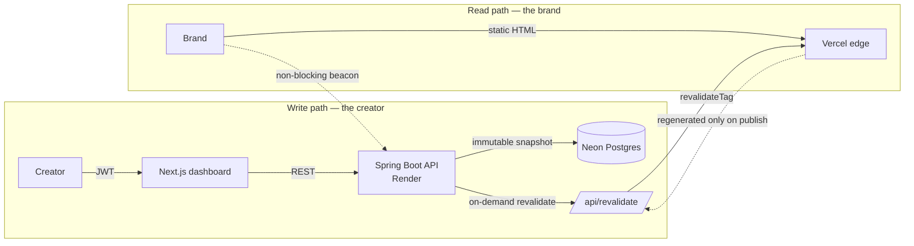

# LocalMediaKit

[](https://github.com/YusufKosarDev/localmediakit/actions/workflows/ci.yml)
[](https://github.com/YusufKosarDev/localmediakit/actions/workflows/security.yml)
[](https://github.com/YusufKosarDev/localmediakit/actions/workflows/e2e.yml)

**A living media kit for content creators.** A creator collects their audience
numbers, demographics and past brand work on one page and publishes it as a link
they send to brands — and sees when a brand opens it.

*[Türkçe README](README.tr.md)*


*Recorded against the real stack with Playwright ([`frontend/demo/`](frontend/demo/)) — no edits, no speed-up. ([webm](docs/media/demo.webm))*

| | |
| --- | --- |
| **Live app** | https://localmediakit.vercel.app |
| **A published page** | https://localmediakit.vercel.app/ornek-medya-kiti |
| **API docs** | https://localmediakit.onrender.com/swagger-ui.html |
| **Dashboard** | `/login` → **"Demo olarak gez"** (`demo@localmediakit.app` / `demo1234`) |

> The backend sleeps after 15 minutes idle, so the first dashboard request can
> take ~50 seconds. **Published pages are not affected** — they never touch the
> backend, which is the point of the section below.

## The architecture in one decision

Everything follows from one split: **the page a brand opens must never depend on
the backend being awake.** The obvious implementation — fetch the kit at request
time — is the one being rejected, because a link a creator already sent cannot
load in 50 seconds just because the free instance behind it was asleep.

So publishing does not make the page live. It **freezes the draft into an
immutable snapshot** (`media_kit_versions.content_json`) and revalidates the edge
cache once. From then on the visitor gets static HTML from the CDN.


```mermaid
flowchart LR
    subgraph W["Write path — the creator"]
        U[Creator] -->|JWT| D[Next.js dashboard]
        D -->|REST| B[Spring Boot API<br/>Render]
        B -->|immutable snapshot| DB[(Neon Postgres)]
        B -->|on-demand revalidate| RV[/api/revalidate/]
    end
    subgraph R["Read path — the brand"]
        M[Brand] -->|static HTML| E[Vercel edge]
        E -.->|regenerated only on publish| RV
        M -.->|non-blocking beacon| B
    end
    RV -->|revalidateTag| E
```

The consequence that makes it real: **editing a draft does not touch the
published page.** Stats, collaborations, rate card and appearance freeze at
publish, and only another publish moves them.


*Edit the draft → the public page is unchanged → publish → now it changes. ([webm](docs/media/snapshot.webm))*

Two things bend around it: analytics is a non-blocking beacon fired *after*
render, and password-protected kits are the one deliberate exception — their
sensitive data never enters the edge cache at all.

## Decisions worth reading

**IDOR is unrepresentable, not prevented.** Every account endpoint lives under
`/api/me` and resolves the subject *only* from the JWT principal. There is no
`/api/users/{id}`, deliberately: a user id is never accepted in a path, query or
body, so one user addressing another is not a check that can be forgotten — it is
a request that cannot be expressed.

**A timing side-channel, found by measuring.** Password reset promises that a
registered address and an unknown one are indistinguishable. Against a real mail
provider they were not — ~1.5s versus ~0.2s, because the SMTP call happened
inline, which is a membership oracle for anyone holding a list of addresses. The
mail moved to an outbox, so every request now does one insert and returns:
measured live at 0.26–0.45s for both. The obvious objection — an outbox needs the
plaintext token, which is exactly what the stored hash withholds — was answered
rather than overruled: the queue row references the token row and the dispatcher
**rotates** it at send time, so nothing that can log in is ever at rest and a
retried delivery is never dead on arrival. Brand enquiries share the outbox for
the ordinary reason: a mail outage must not lose a lead.

**Analytics that cannot identify anyone.** The visitor fingerprint is
`sha256(ip | user-agent | day | salt)`; the raw IP never leaves the function that
hashes it. Because the hash includes the day it rotates at midnight — which also
means "all-time unique visitors" was always a sum of daily uniques, so retention
can fold raw rows into a daily rollup and delete them without moving any number.

**Accent colours are a curated list, not a colour picker.** Each accent's
contrast was computed against the surfaces it is actually drawn on, in both
themes, and `tests/palette.test.ts` recomputes those ratios *from the shipped
CSS* — so adding an inaccessible colour breaks CI. A picker would have made
producing an unreadable page a user's choice.

**Secrets fail loudly.** Every security-critical value has a working local
default so a clone runs with zero setup — which means a missing production
variable would silently sign session tokens with a key published in this
repository. `ProductionSecretsCheck` refuses to boot the prod profile while any
still carries the `local-dev-` marker. It checks the marker rather than a list,
so a secret added later inherits the protection. It has already fired in
production once, exactly as intended.

## Quality

330 backend tests (concurrency races driven by `CyclicBarrier`, migrations run
against a *populated* database, N+1 query-count assertions), 105 frontend tests,
and 13 Playwright end-to-end tests against both servers running for real.
ArchUnit rules fail the build — no field injection, controllers never touch
repositories. PIT kills 97% of 144 mutations on the critical packages. Four CI
workflows: `ci.yml` (H2, **a second job against real PostgreSQL**, frontend),
`e2e.yml`, `security.yml` (Trivy + CodeQL), weekly `mutation.yml`.
`MigrationOnPopulatedDatabaseTest` exists because a migration once wrote a
lowercase default into a column mapped to an uppercase enum and every
pre-existing account became unloadable — an empty schema cannot see that.

## Honest limits

- **Mail lands in spam more often than it should** — a `gmail.com` sender relayed
  through Brevo fails DMARC alignment. The fix is a custom domain with SPF/DKIM.
- **A single instance is assumed in three places** — rate-limit buckets, the
  password-attempt counter and the jobs' overlap guards are in-memory. A second
  instance would not crash; it would silently double them, which is worse.
- **Avatars are URLs, not uploads.** Free-tier disks are wiped on deploy.
- **`<html lang>` is hardcoded to `tr`**, so a kit published in English declares
  Turkish to a screen reader. The published language is already per-kit; the
  layout has not caught up.

## Running it locally

```bash
cp frontend/.env.example frontend/.env.local
cd backend  && mvn spring-boot:run                        # H2 in-memory, :8080
cd frontend && pnpm install && pnpm build && pnpm start    # :3000
```

**Stack:** Java 21 · Spring Boot 3.5 · Flyway · Neon Postgres (H2 locally, same
migrations) · Next.js 16 · React 19 · TypeScript · Vercel + Render.
