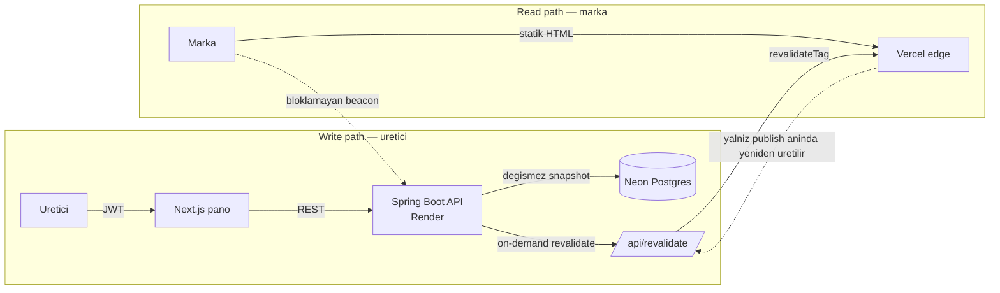

# LocalMediaKit

[](https://github.com/YusufKosarDev/localmediakit/actions/workflows/ci.yml)
[](https://github.com/YusufKosarDev/localmediakit/actions/workflows/security.yml)
[](https://github.com/YusufKosarDev/localmediakit/actions/workflows/e2e.yml)

**Icerik ureticileri icin canli medya kiti.** Uretici; takipci sayilarini,
kitle demografisini ve gecmis marka isbirliklerini tek bir sayfada toplar ve
markalara gonderdigi bir link olarak yayinlar. Marka o linki actiginda uretici
bunu gorur.

*[English README](README.md)*


*Playwright ile gercek yigina karsi kaydedildi ([`frontend/demo/`](frontend/demo/)) — montaj yok, hizlandirma yok. [webm surumu](docs/media/demo.webm).*

| | |
| --- | --- |
| **Canli uygulama** | https://localmediakit.vercel.app |
| **Yayinlanmis bir sayfa** | https://localmediakit.vercel.app/ornek-medya-kiti |
| **API dokumantasyonu** | https://localmediakit.onrender.com/swagger-ui.html |
| **Panoyu gez** | `/login` → **"Demo olarak gez"** (`demo@localmediakit.app` / `demo1234`, saat basi sifirlanir) |

> Backend, 15 dakika istek almazsa uykuya gecen bir ucretsiz katmanda; bu yuzden
> panoya ilk giris ~50 saniye surebilir. **Yayinlanmis sayfalar bundan
> etkilenmez** — edge'den servis edilirler ve backend'e hic dokunmazlar. Asagidaki
> bolumun tamami zaten bunun icin var.

---

## Mimarinin tamami tek bir karardan cikiyor

Projedeki her sey su tek ayrimdan tureniyor: **markanin actigi sayfa, backend'in
uyanik olmasina asla bagli olmamali.**

Akla ilk gelen cozum, kiti istek aninda cekip render etmek. O reddedildi ve
tasarim tam olarak bu reddin kendisi. Ureticinin markaya coktan gonderdigi bir
link, arkasindaki ucretsiz instance uyudugu icin 50 saniyede acilamaz — o linkin
acildigi an, urunun var olma sebebi olan tek an.

Bu yuzden yayinlamak "sayfayi canli yapmak" degil. Yayinlamak, **taslagi degismez
bir snapshot'a dondurur** (`media_kit_versions.content_json`) ve edge cache'i bir
kez revalidate eder. O andan sonra ziyaretciye CDN'den statik HTML gider. Backend
tamamen kapali olabilir; sayfa yine acilir.



Bunu somut kilan sonuc: **taslagi duzenlemek yayindaki sayfaya dokunmaz.**
Istatistikler, demografi, isbirlikleri, rate card ve gorunum publish aninda
donar; onlari ancak bir sonraki publish oynatir.


*Iddia, kamera onunde: taslagi degistir → public sayfa degismedi → yayinla → simdi degisti. ([webm](docs/media/snapshot.webm))*

Bu karar iki seyi bukmek zorunda birakti ve ikisi de yorumda degil kodda:

- **Analitik.** Statik bir sayfa goruntulenmeyi sunucu tarafinda bildiremez.
  Render'dan *sonra* bloklamayan bir beacon atilir; backend uykudaysa sessizce
  duser ve edge HIT bozulmaz.
- **Sifre korumali kitler.** Kuralin bilincli tek istisnasi: hassas veri edge
  cache'ine hic girmez, kilit acma per-request bir backend cagrisidir. Geri kalan
  her kit yine edge HIT alir.

---

## Okumaya deger muhendislik kararlari

**IDOR engellenmis degil, ifade edilemez.** Butun hesap uclari `/api/me` altinda
ve ozneyi *yalnizca* JWT principal'indan cozer. `/api/users/{id}` karsiligi
bilerek yok. Kullanici kimligi path'te, query'de veya govdede hicbir zaman kabul
edilmedigi icin "bir kullanicinin digerini adreslemesi" unutulabilecek bir
kontrol degil, kurulamayan bir istek. Kit uclarinda ayni fikir
`findByIdAndUserId` sahiplik sorgusu olarak duruyor.

**Maili outbox'a tasiyarak kapatilan bir zamanlama yan kanali.** Sifre sifirlama,
kayitli bir adresle bilinmeyen bir adresin ayirt edilemeyecegini vaat eder.
Gercek bir saglayiciya karsi olculdugunde etmiyordu: SMTP cagrisi istegin icinde
oldugu icin hesabi olan adres ~1.5 sn, olmayan ~0.2 sn suruyordu. Elinde adres
listesi olan biri icin bu bir uyelik sorgusu. Mail artik kuyruga aliniyor, her
istek tek bir insert yapip donuyor — canlida iki durum icin de 0.26–0.45 sn
olculdu, gurultunun icinde ayirt edilemez. Akla gelen itiraz (outbox duz metin
token ister, oysa hash'in var olma sebebi tam da onu saklamamak) gecersiz
kilinmadi, **cozuldu**: kuyruk satiri token satirina *referans* tutar, gonderim
aninda dispatcher o satiri **dondurur** — yeni sir, yeni hash, yeni son kullanma.
Giris yapabilecek hicbir sey diske inmez; ustelik 30 dakikalik omur mailin
ciktigi anda basladigi icin yeniden denemeyle gecikmis bir teslimat da olu link
tasimaz.

**Ucuncu tarafin kaybedebilecegi her sey outbox'ta.** Markanin teklifi, bildirim
satiriyla **ayni transaction'da** yazilir — ucuz bir insert, ag cagrisi yok — bu
yuzden mail saglayicisi bir lead'i yavaslatamaz, basarisiz edemez, kaybettiremez.
SMTP coktugunde olan tek sey satirlarin `PENDING` beklemesidir. Her satir kendi
transaction'inda, ustel backoff ve terminal `FAILED` durumuyla islenir; boylece
bir kotu adres yanindaki basarili gonderimleri geri alamaz.

**Kimseyi tanimlayamayan analitik.** Ziyaretci parmak izi
`sha256(ip | user-agent | gun | salt)`; ham IP onu hash'leyen fonksiyondan disari
cikmaz ve hicbir yerde saklanmaz. Hash gunu de icerdigi icin gece yarisi doner —
bunun ikinci anlami su: "tum zamanlarin tekil ziyaretcisi" zaten gunluk
tekillerin toplamiydi, dolayisiyla retention job'u ham satirlari gunluk ozete
katlayip silebiliyor ve omur boyu sayilar hic oynamiyor.

**Engagement bir strategy, ve yaniltici sifir yerine `Optional.empty()`.** Her
platform etkilesimi farkli hesaplar (Instagram takipciden, YouTube ve TikTok
izlenmeden). Tek arayuz, platform basina bir implementasyon, bir registry. Asil
onemli kisim donus tipi: verisi yetersiz bir platform `0.0` degil bos doner,
cunku rate card'da "%0 etkilesim" yazmasi hic yazmamasindan daha kotudur.

**Vurgu renkleri kurate bir liste, renk secici degil.** Her rengin kontrasti,
gercekten uzerine cizildigi yuzeylere karsi, hem acik hem koyu modda hesaplandi;
altisi da WCAG AA geciyor. `tests/palette.test.ts` bu oranlari **sevk edilen
CSS'ten** yeniden hesaplar, dolayisiyla erisilemez bir renk eklemek CI'i kirar.
Secici koyulsaydi okunamayan bir sayfa uretmek kullanicinin tercihi olurdu; bu
tasarimda ifade edilemiyor.

**Secret'lar sessizce degil, gurultuyle patlar.** Guvenlik acisindan kritik her
degerin calisan bir yerel varsayilani var, boylece repoyu klonlayan sifir kurulumla
calistirir — ki bu da uretimde eksik kalan bir degiskenin, oturum tokenlerini bu
repoda yayinlanmis bir sirla imzalamasi demek. `ProductionSecretsCheck`, bunlardan
biri hala `local-dev-` isaretini tasirken prod profilini baslatmayi reddeder.
Bilinen degerlerin listesini degil **isareti** kontrol eder, dolayisiyla sonradan
eklenen bir secret korumayi yalnizca kurala uyarak devralir. Uretimde bir kez tam
da amaclandigi gibi devreye girdi.

---

## Kalite

| | |
| --- | --- |
| **Backend** | 330 test (JUnit) — `CyclicBarrier` ile uretilen eszamanlilik yarislari, **dolu** bir veritabanina karsi migration'lar, N+1 icin sorgu sayisi iddialari dahil |
| **Frontend** | 105 test (Vitest + Testing Library) |
| **Uctan uca** | Iki sunucu da gercekten ayaktayken 13 Playwright testi |
| **Mimari** | ArchUnit kurallari build'i kirar — field injection yok, controller repository'ye dokunmaz, entity web katmanina bagimli olmaz |
| **Mutasyon** | Kritik paketlerde PIT: 144 mutasyon, %97'si olduruldu |
| **CI** | Dort workflow: `ci.yml` (H2 + **gercek PostgreSQL'e karsi ikinci job**, Testcontainers + frontend), `e2e.yml`, `security.yml` (Trivy + CodeQL `security-extended`), `mutation.yml` |

Bunlardan ikisi belirli olaylar yuzunden var. `MigrationOnPopulatedDatabaseTest`
var, cunku bir migration bir kez kucuk harfli varsayilani buyuk harfli bir enum'a
eslenen kolona yazdi: o andan onceki her hesap yuklenemez oldu ve kendi
`/api/me` ucunda 500 dondu. Bos semadan baslayan bir paket bunu goremez.
Rezerve slug testi ise `frontend/app` dizinini okur ve bir rota rezerve edilmeden
eklendiginde **backend** build'ini kirar — cunku ureticilerin kit adresi olarak
sahiplenebilecegi uc rota coktan sevk edilmisti.

---

## Durust sinirlar

- **Mailler olmasi gerekenden sik spam'e dusuyor.** Gonderen bir `gmail.com`
  adresi ve mail Brevo rolesinden cikiyor, dolayisiyla DMARC hizalamasi tutmuyor.
  Duzgun cozumu SPF/DKIM kayitlariyla ozel bir domain — uygulamanin hala
  `*.vercel.app` uzerinde olmasinin sebebi de bu.
- **Uc yerde tek instance varsayiliyor** — rate-limit kovalari, sifre denemesi
  sayaci ve zamanlanmis islerin overlap guard'lari bellekte. Ikinci bir instance
  cokmez; limitleri sessizce carpar ve batch'leri iki kez calistirir, ki daha
  tehlikeli bozulma bicimi budur. Cozumu sirasiyla Redis destekli Bucket4j ve
  ShedLock.
- **Avatarlar yukleme degil, URL.** Ucretsiz katman diski her deploy'da
  siliniyor; nesne deposu ya ucretli bir servis ya da sessizce veri kaybeden bir
  cozum olurdu.
- **`<html lang>` sabit `tr`.** Ingilizce yayinlanmis bir kit yine Turkce
  bildiriyor ve ekran okuyucu buna gore davraniyor. Yayin dili zaten kit basina
  tutuluyor; layout henuz yetismedi.
- **API versiyonlama yok.** Tek bir istemci var, o da bu repoda ve ayni commit'ten
  dagitiliyor. Versiyonlama, kontrolunuzde olmayan istemciler oldugunda deger
  uretir; kirilgan olan kisim — cache'lenen public payload'in sekli — zaten
  `PUBLIC_SCHEMA_VERSION` ile ele aliniyor.
- **E-posta degisimi linkle degil sifreyle onaylanir.** Asil onemli kontrol
  yeniden kimlik dogrulamasi, ama yeni adresteki bir yazim hatasi yakalanmiyor.
  Mail altyapisi artik var, dolayisiyla bu engellenmis degil, yapilmamis bir is.

---

## Yerelde calistirma

```bash
cd backend  && mvn spring-boot:run     # H2 in-memory, sifir kurulum, :8080
cd frontend && pnpm install && pnpm build && pnpm start   # :3000
```

Once `cp frontend/.env.example frontend/.env.local`. `localhost:3000` uzerinden
kayit olun, kit olusturup yayinlayin; sayfa `localhost:3000/<slug>` adresinde
gorunur.

**Yigin:** Java 21 · Spring Boot 3.5 · Flyway · Neon Postgres (yerelde H2, ayni
migration'lar) · Next.js 16 App Router · React 19 · TypeScript · Vercel + Render.
