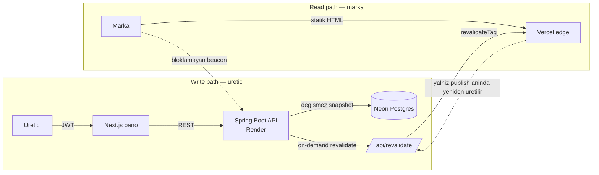

# LocalMediaKit

[](https://github.com/YusufKosarDev/localmediakit/actions/workflows/ci.yml)
[](https://github.com/YusufKosarDev/localmediakit/actions/workflows/security.yml)
[](https://github.com/YusufKosarDev/localmediakit/actions/workflows/e2e.yml)

**Icerik ureticileri icin canli medya kiti.** Uretici; takipci sayilarini, kitle
demografisini ve gecmis marka isbirliklerini tek sayfada toplar, markalara
gonderdigi bir link olarak yayinlar ve o linkin ne zaman acildigini gorur.

*[English README](README.md)*


*Playwright ile gercek yigina karsi kaydedildi ([`frontend/demo/`](frontend/demo/)) — montaj yok, hizlandirma yok. ([webm](docs/media/demo.webm))*

| | |
| --- | --- |
| **Canli uygulama** | https://localmediakit.vercel.app |
| **Yayinlanmis bir sayfa** | https://localmediakit.vercel.app/ornek-medya-kiti |
| **API dokumantasyonu** | https://localmediakit.onrender.com/swagger-ui.html |
| **Pano** | `/login` → **"Demo olarak gez"** (`demo@localmediakit.app` / `demo1234`) |

> Backend 15 dakika istek almazsa uykuya geciyor, panoya ilk giris ~50 saniye
> surebilir. **Yayinlanmis sayfalar bundan etkilenmez** — backend'e hic
> dokunmazlar, ki asagidaki bolumun tamami zaten bunun icin.

## Mimarinin tamami tek bir karardan cikiyor

Her sey su tek ayrimdan tureniyor: **markanin actigi sayfa, backend'in uyanik
olmasina asla bagli olmamali.** Akla ilk gelen cozum — kiti istek aninda cekmek —
tam da reddedilen sey; cunku ureticinin coktan gonderdigi bir link, arkasindaki
ucretsiz instance uyudugu icin 50 saniyede acilamaz.

Bu yuzden yayinlamak sayfayi canli yapmak degil. Yayinlamak **taslagi degismez
bir snapshot'a dondurur** (`media_kit_versions.content_json`) ve edge cache'i bir
kez revalidate eder. Sonrasinda ziyaretciye CDN'den statik HTML gider.



Bunu somut kilan sonuc: **taslagi duzenlemek yayindaki sayfaya dokunmaz.**
Istatistikler, isbirlikleri, rate card ve gorunum publish aninda donar; onlari
ancak bir sonraki publish oynatir.


*Taslagi degistir → public sayfa degismedi → yayinla → simdi degisti. ([webm](docs/media/snapshot.webm))*

Bu karar iki seyi bukuyor: analitik, render'dan *sonra* atilan bloklamayan bir
beacon; sifre korumali kitler ise bilincli tek istisna — hassas verileri edge
cache'ine hic girmez.

## Okumaya deger kararlar

**IDOR engellenmis degil, ifade edilemez.** Butun hesap uclari `/api/me` altinda
ve ozneyi *yalnizca* JWT principal'indan cozer. `/api/users/{id}` karsiligi
bilerek yok: kullanici kimligi path'te, query'de veya govdede kabul edilmedigi
icin "birinin digerini adreslemesi" unutulabilecek bir kontrol degil, kurulamayan
bir istek.

**Olcerek bulunan bir zamanlama yan kanali.** Sifre sifirlama, kayitli bir
adresle bilinmeyen bir adresin ayirt edilemeyecegini vaat eder. Gercek bir
saglayiciya karsi etmiyordu — SMTP cagrisi istegin icinde oldugu icin ~1.5 sn'ye
karsi ~0.2 sn, ki bu elinde adres listesi olan biri icin bir uyelik sorgusu. Mail
outbox'a tasindi; her istek artik tek bir insert yapip donuyor, canlida iki durum
icin de 0.26–0.45 sn olculdu. Akla gelen itiraz — outbox duz metin token ister,
oysa hash'in var olma sebebi tam da onu saklamamak — gecersiz kilinmadi, cozuldu:
kuyruk satiri token satirina referans tutar, dispatcher gonderim aninda onu
**dondurur**, boylece giris yapabilecek hicbir sey diske inmez ve yeniden denenen
bir teslimat olu link tasimaz. Marka teklifleri de ayni outbox'ta: bir mail
kesintisi bir lead'i kaybettirememeli.

**Kimseyi tanimlayamayan analitik.** Ziyaretci parmak izi
`sha256(ip | user-agent | gun | salt)`; ham IP onu hash'leyen fonksiyondan disari
cikmaz. Hash gunu icerdigi icin gece yarisi doner — bunun ikinci anlami su: "tum
zamanlarin tekil ziyaretcisi" zaten gunluk tekillerin toplamiydi, dolayisiyla
retention ham satirlari gunluk ozete katlayip silebiliyor ve hicbir sayi oynamiyor.

**Vurgu renkleri kurate bir liste, renk secici degil.** Her rengin kontrasti,
gercekten uzerine cizildigi yuzeylere karsi ve her iki temada hesaplandi;
`tests/palette.test.ts` bu oranlari **sevk edilen CSS'ten** yeniden hesapladigi
icin erisilemez bir renk eklemek CI'i kirar. Secici koyulsaydi okunamayan bir
sayfa uretmek kullanicinin tercihi olurdu.

**Secret'lar sessizce degil, gurultuyle patlar.** Kritik her degerin calisan bir
yerel varsayilani var, boylece repoyu klonlayan sifir kurulumla calistirir — ki
bu da uretimde eksik kalan bir degiskenin, oturum tokenlerini bu repoda
yayinlanmis bir sirla imzalamasi demek. `ProductionSecretsCheck`, bunlardan biri
hala `local-dev-` isaretini tasirken prod profilini baslatmayi reddeder. Listeyi
degil isareti kontrol ettigi icin sonradan eklenen bir secret korumayi devralir.
Uretimde bir kez tam da amaclandigi gibi devreye girdi.

## Kalite

330 backend testi (`CyclicBarrier` ile uretilen eszamanlilik yarislari, **dolu**
bir veritabanina karsi migration'lar, N+1 icin sorgu sayisi iddialari), 105
frontend testi, iki sunucu da gercekten ayaktayken 13 Playwright testi. ArchUnit
kurallari build'i kirar — field injection yok, controller repository'ye dokunmaz.
Kritik paketlerde PIT, 144 mutasyonun %97'sini olduruyor. Dort CI workflow:
`ci.yml` (H2, **gercek PostgreSQL'e karsi ikinci job**, frontend), `e2e.yml`,
`security.yml` (Trivy + CodeQL), haftalik `mutation.yml`.
`MigrationOnPopulatedDatabaseTest` var, cunku bir migration bir kez kucuk harfli
varsayilani buyuk harfli bir enum'a eslenen kolona yazdi ve o andan onceki her
hesap yuklenemez oldu — bos sema bunu goremez.

## Durust sinirlar

- **Mailler olmasi gerekenden sik spam'e dusuyor** — Brevo rolesinden cikan bir
  `gmail.com` gondereni DMARC hizalamasini gecemiyor. Cozumu SPF/DKIM'li ozel
  bir domain.
- **Uc yerde tek instance varsayiliyor** — rate-limit kovalari, sifre denemesi
  sayaci ve islerin overlap guard'lari bellekte. Ikinci bir instance cokmez;
  sessizce ikiye katlar, ki bu daha kotusu.
- **Avatarlar yukleme degil, URL.** Ucretsiz katman diski her deploy'da siliniyor.
- **`<html lang>` sabit `tr`**, yani Ingilizce yayinlanmis bir kit ekran
  okuyucuya Turkce bildiriyor. Yayin dili zaten kit basina tutuluyor; layout
  henuz yetismedi.

## Yerelde calistirma

```bash
cp frontend/.env.example frontend/.env.local
cd backend  && mvn spring-boot:run                        # H2 in-memory, :8080
cd frontend && pnpm install && pnpm build && pnpm start    # :3000
```

**Yigin:** Java 21 · Spring Boot 3.5 · Flyway · Neon Postgres (yerelde H2, ayni
migration'lar) · Next.js 16 · React 19 · TypeScript · Vercel + Render.
